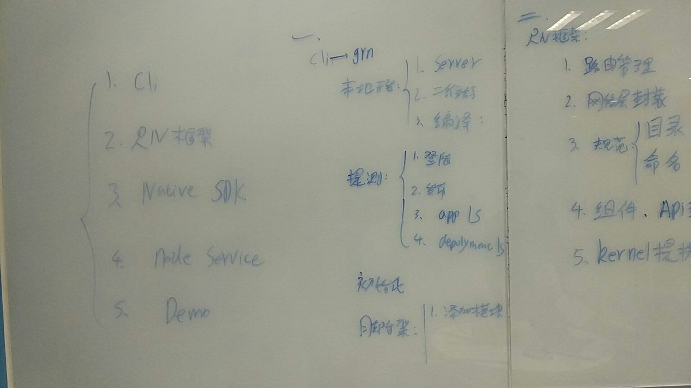
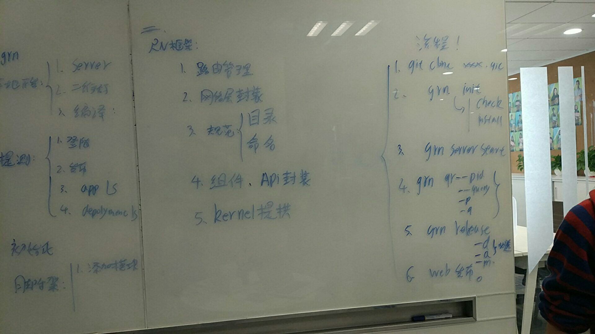
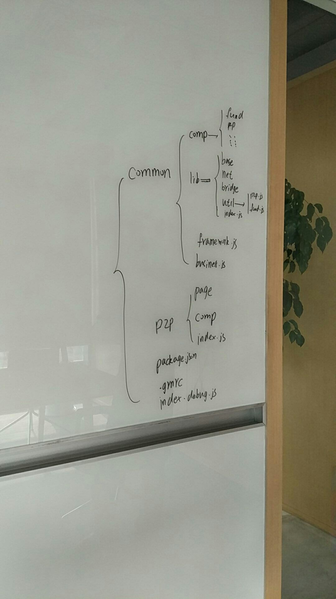
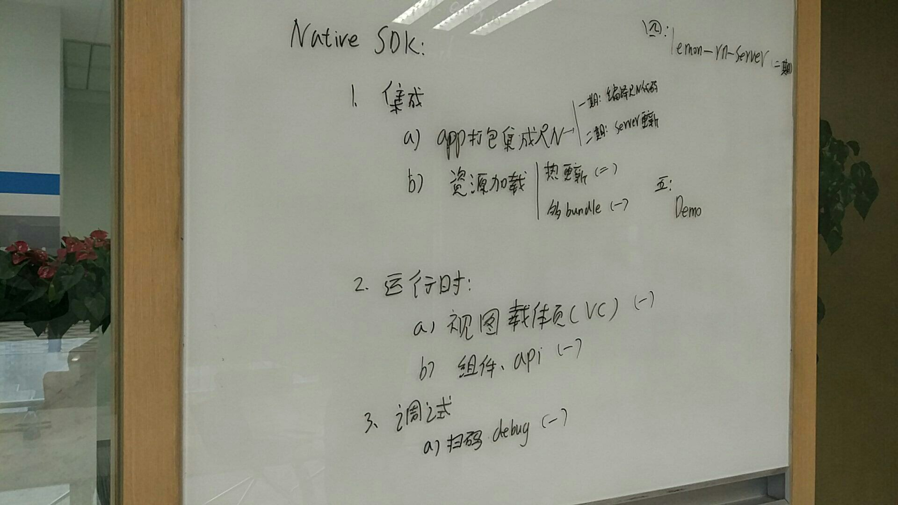

# 这周过的挺快的

这周仍旧只是做了一些力所能及的小事, 梳理一下, 就是下面这些了:

* 人人学院 项目的service层开发
* `react native`和王大爷/绍彬召开了第二次会议
* PC网站拆分bug及上线前准备

## 人人学院 service层开发

人人学院, 听上去牛逼哄哄的, 其实就是一个论坛的阉割版, 需求方说主要是为了做`SEO`, 提升我们PC站的排名, 里面就是发布一些理财百科/热点新闻之类的文章
, 允许用户浏览&点赞, 甚至还提供了 **搜索** 功能. 为什么要做 **搜索** 呢, 需求方说, 因为这是为了 `SEO`(搜索引擎优化). 不过`SEO`和我们提供一个搜索
功能, 真的有关系么

第一次在`node.js`环境使用 `MySQL` 数据库, 上次开发内部`CMS`的时候, 我就想试试`MySQL`, 结果上层二货非要用`mongodb`, 你懂的, 领导的面子, 还是
要给的嘛

这次`node.js`里使用MySQL, 主要就是使用 [这个库](https://github.com/mysqljs/mysql) , 当然直接使用, 挺不方便的, 于是copy了阿里的[这个库](https://github.com/ali-sdk/ali-rds)
里的一些方法, 将底层的 `INSERT/SELECT/UPDATE/DELETE` 封装了一下, 方便具体的`model`来使用.

还有一个地方很纠结, 我强制使用了MySQL **连接池**, 但是具体每个`node.js`进程里允许持有的**最大连接数**, 应该设置为多少才合适呢, 完全没概念了, 下周
问问后端同学是怎么配置的吧

## 和 王大爷&绍彬 顺利进行了关于 `react native` 框架的第二次会议

节前貌似讨论过一次了, 那次把**热更新**server端的MySQL表结构都定下来了, 这次把`grn-cli`, `native` 部分的功能又细化了一下.

具体就看下面几个图片吧

1. 大纲
    
    
2. JS代码目录规范
    
3. native 部分
    

传说下周就要开工了， 完全不知道咋下手嘛……

## PC网站拆分bug&上线前准备

PC网站拆分， 应该测试了2周多了吧，昨天突然跟我说IE下两个域名的登录状态， **没有** 同步！！！ 都测试了两周了，突然给我说这个，也是醉了。。。。关键是，QA居然说前天都可以同步的……

赶紧搜吧，本来准备今天上备机测试， 下周3就正式上线的， 都这个点了， 给我来这么严重的bug。

原来是IE下面默认 **拒绝** `第三方cookie`， 需要设置 **P3P** 才行。加上之后，果然妥妥滴了。
