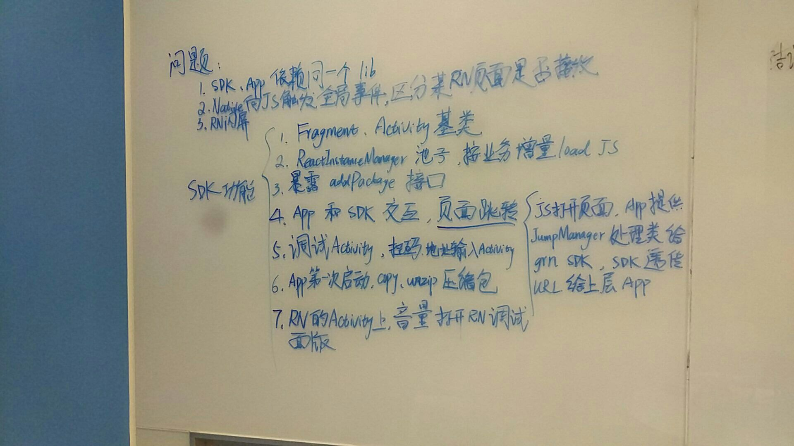

# 5月1号 ~ 5月7号

## 5月1号

### `react-native`第三次讨论，SDK功能细化

其实这是上周4月26号讨论的，当时忘记写了，今天补上，主要是明确了`SDK`中具体的一些功能，以及在封装
`native`功能时的代码组织原则。

先暂时将我们的`react-native SDK`命名为`lemon`吧，下文的`lemon`都是指的我们封装的`react-native SDK`.

#### 主要结论

* `lemon`内部依赖`react-native框架`，上层应用 **不直接依赖`react-native 框架`**，上层应用
直接依赖`lemon`
* `lemon`包含对`react-native`的初始化，提供公共的`package`添加方法等
* `lemon`内部维护`ReactInstanceManager`的池子，增量加载各个业务对应的`bundle`
* `lemon`提供封装好的`Fragment` `Activity`基类，用于渲染`RN页面`
* `lemon`提供调试功能，封装扫码、音量键打开RN调试面板等

具体见下图：

