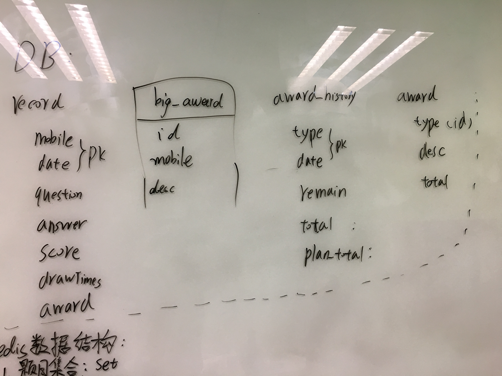
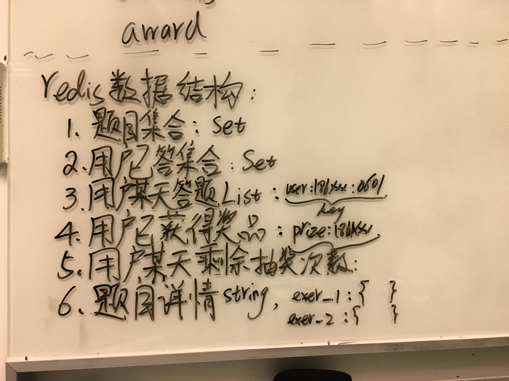
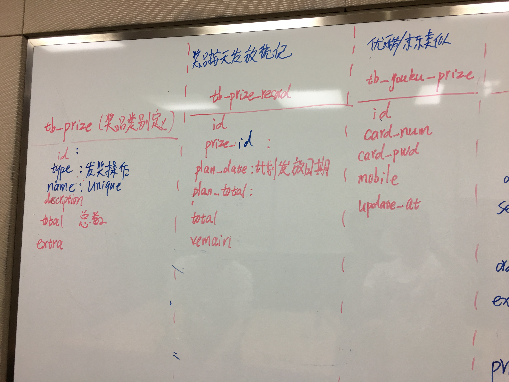
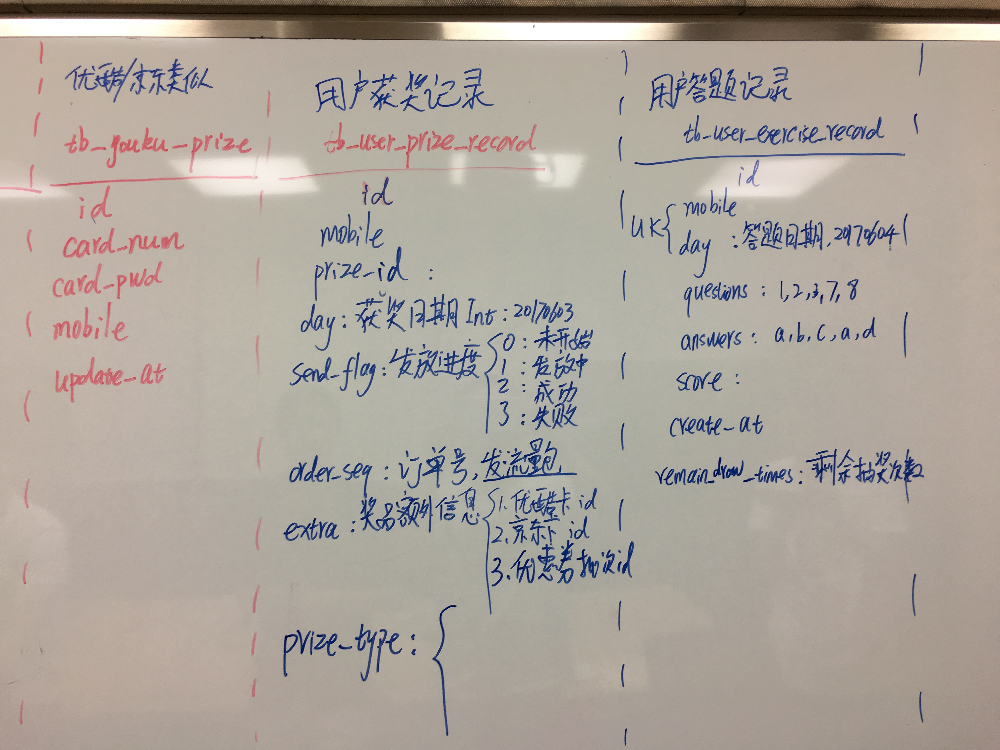

# 20170515 - 20170521


## 5月15号

今天和产品运营就答题活动，在友(ji)好(lie)的气氛中，又进行了一次讨(si)论(bi)。发现需求改动较大，
本来上周计划的数据结构、表设计，基本都不能用了……

下午和王大爷、刘聪，就新的需求定了下MySQL的表结构和redis数据结构，还是不清楚设计的合理不，没玩后端，
确实不知道这种case应该怎么来操刀啊，明天得学习下后端之前的活动数据表是怎么设计的。

今天讨论暂定 **MySQL数据库表结构** ：



**redis数据结构** ：




## 5月16号

早上学习了下后端同学上一个转盘抽奖活动的MySQL表设计，对昨天的表略有改动，晚上和后端成俊一起review
新的表结构，大概是这样的：




但是有个遗留问题，下面这样去跟新MySQL的列，不知道会不会有并发问题：

```SQL
update tb_name set count = count - 1 where id = 1000;
```

如果多个连接同事执行上面的语句，得确认下是否有并发问题，之前Google上 **貌似** 看到说 **没有并发问题**，
但昨晚成俊说应该是有问题的，这个看来得找专业的DBA来指导下了。

关于动态调整各个奖项的中奖概率问题，也从成俊那学到一个很巧妙的方法，比如把1分成10000份，运营在CMS填写
各个奖品在10000份里的中奖概率，比如奖品A是100，奖品B是300，那么在 `redis` 里生成一个10000大小的
`list`，包含100个A，300个B等等，然后在程序里生成随机数，直接去这个`list`里获取对应下表的值，即使命中
的奖品类型。

## 5月17号
