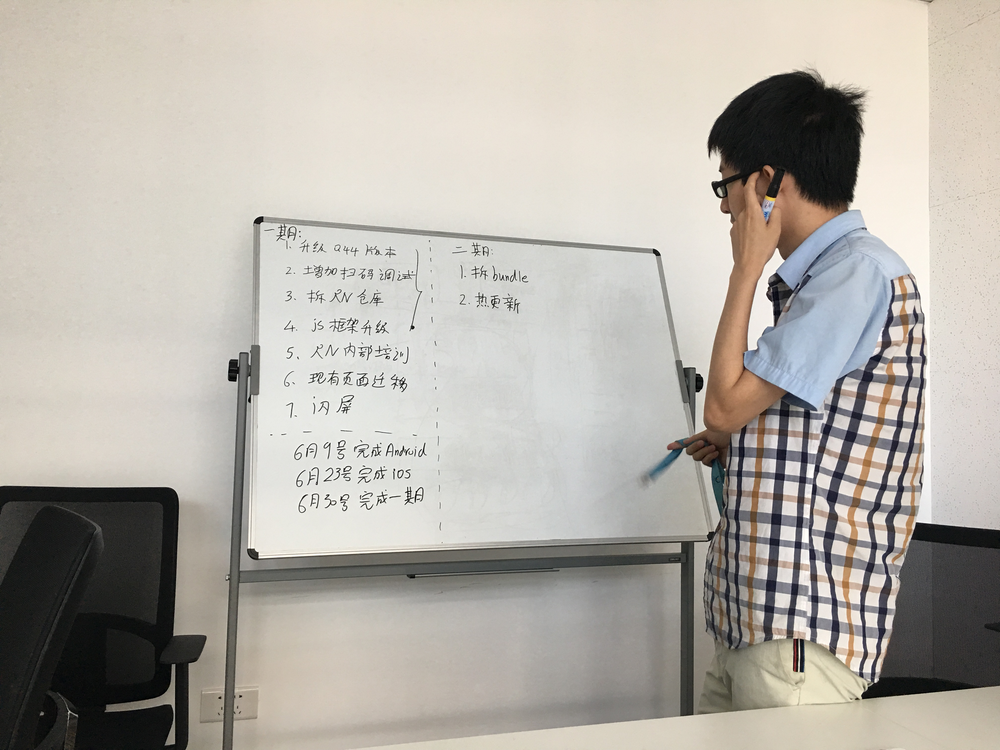

# 20170529 - 20170604

节前吭哧吭哧写了一两周的答题活动，再提测的那一刹那，PM通知活动 **取消**，不上线了……

## 5月31号

由于之前规划的`React Native`框架开发中途，插入了别的活动，上次讨论(4月底)的东东都忘光了，
今天又和王大爷、绍彬重新开会，并且把第一期的目标再次缩减了些，为了第一期能尽快上线。

* 第一期 **不再** 拆分bundle
* 第一期 **不提供** 多个 `ReactInstanceManager`
* 扫码加载远程bundle及对应页面

具体如下图：

## 6月1号

看了好多 `tcp backlog`的文章，头都懵了……

## 6月2号

午觉过后，王大爷又赶脚之前定下的 `React Native` 新架构的JS端目录结构，不太满意，拉着绍彬和我
又改了下，改成下面这副鬼样子了……

## 6月3号
