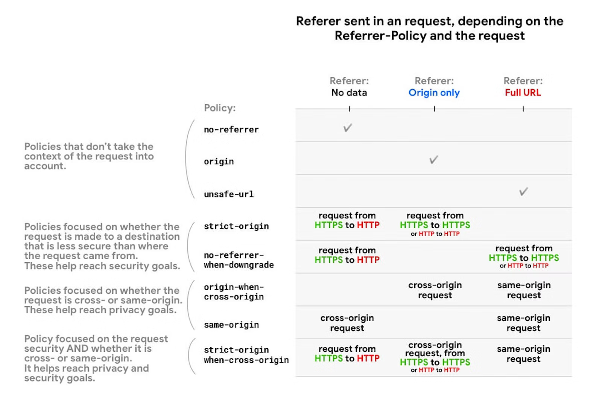
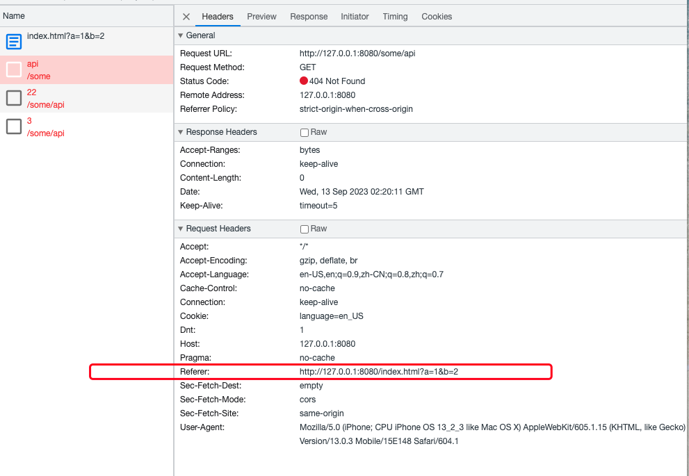
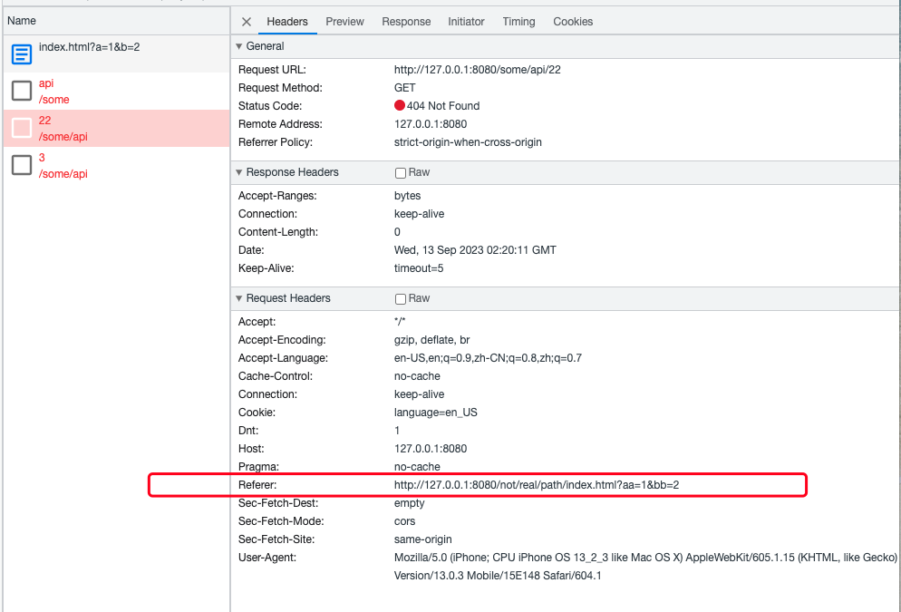
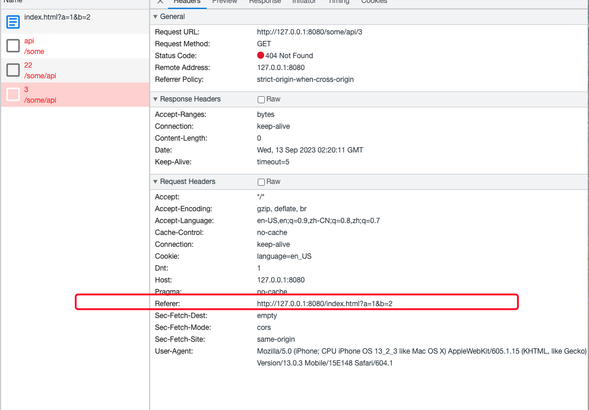

#重新认识HTTP Referer


> 最近看到大佬的一篇文章，关于传统 XHR 和 fetch() 的异同，里面提到传统XHR不能修改请求头的Referer，但是fetch() 可以。在我认知里，请求头的Referer应该是不能修改的，所以下来查阅了一些资料，有了这篇文章，也算是重新认识了HTTP Referer了。


本文按下面以部分来展开：

* 什么是HTTP Referer
* Referrer-Policy
* fetch()设置referrer


## 什么是HTTP Referer

HTTP Referer 头部是一种在 HTTP 请求中常见的头部字段，用于标识请求的来源页面。它提供了引荐信息，告诉服务器当前请求是从哪个页面链接过来的。


Referer 头部通常包含了完整的 URL，包括协议、域名、路径(path)、查询参数(query)（**注意：并没有包括URL的hash部分**）等信息。


通常可以把 `Referer` 分为两种情况：

* 当用户在页面上链接进行页面跳转时，也可以说是浏览器导航到新的链接，比如用户在页面里点击了一个 `a` 标签，跳转到新的页面。这种情况下，在请求新的页面时 *可能* 带上 `Referer` 头
* 在页面内，请求页面依赖的其他资源，比如 图片、iframe、script脚本、视频等等


Referer 头部在网页开发和网络分析中具有重要作用。通过了解请求的来源，开发人员可以进行统计分析，跟踪流量来源，并根据这些信息做出相应的处理。同时，一些应用场景下，比如 **防止盗链**操作，也可以利用 Referer 头部来验证请求的合法性。

然而，使用 Referer 头部也存在安全性和隐私问题。它有可能泄露用户敏感信息，因为 Referer 头部会将包含敏感数据的URL发送给目标网站。因此，在实际应用中需要采取措施保护用户隐私，避免泄露敏感信息。


以前，我们会认为请求header中的 `Referer` 是浏览器自动行为，web开发者不能通过 `JavaScript` 等方式来设置或修改。但现在，我们有了 `Referrer-Policy`，可以在一定程度上控制发送给服务端的 `Referer` 应该按照什么规则来设置。


## Referrer-Policy

### Referrer-Policy基本介绍

`Referrer-Policy` 是一个 HTTP 头部，用于控制浏览器在发送 `HTTP `请求时如何处理 `Referer`（引用页面）字段。`Referer` 字段包含了当前请求的来源页面的 `URL`。

通过设置 `Referrer-Policy` 头部，网站管理员可以指定浏览器在发送请求时是否应该包含 `Referer` 字段以及如何处理它。这样可以帮助保护用户的隐私和提供更好的安全性。

以下是一些常见的 `Referrer-Policy` 值和其作用：

*	 `no-referrer`：不发送 Referer 头部。这意味着目标网站无法知道访问来源。 

- `no-referrer-when-downgrade`：默认值。对于从 HTTPS 页面跳转到 HTTP 页面的请求，不发送 Referer 头部；其他情况下会发送。 
- `same-origin`：只有当目标与当前页面具有相同的源（协议、主机和端口），才发送 Referer 头部。
-  `origin`：只发送源（协议、主机和端口），不包含路径和查询参数。 例如 `https://example.com/page.html` 会将 `https://example.com/ 作为引用地址`。
- `strict-origin`：在同等安全级别的情况下，发送文件的源作为引用地址 (HTTPS->HTTPS)，但是在降级的情况下不会发送 (HTTPS->HTTP)。
- `origin-when-cross-origin`：对于同源请求，发送完整的 Referer；对于跨域请求，只发送源（协议、主机和端口）。 
-  `strict-origin-when-cross-origin`：（**如果开发者没有显式设置 `Referrer-Policy`，这个是浏览器的默认设置**）
  - 对于同源请求，发送完整的 Referer；
  - 对于跨域请求：在访问协议具有相等安全等级的情况下(HTTPS -> HTTPS)，只发送源（协议、主机和端口）。在安全等级降低的情况下(HTTPS -> HTTP)，不发送 Referer；
- `unsafe-url`： 无论是同源请求还是非同源请求，都发送完整的 URL（移除参数信息之后）作为引用地址。


### Referrer Policy设置方式

有以下几种方式来设置 `Referrer Policy`：

* 可以在资源请求的响应头中设置，比如 `Referrer-Policy: strict-origin-when-cross-origin`
* 可以在 `HTML` 页面内，通过 `<meta> ` 标签设置，比如：`<meta name="referrer" content="origin" />`
* 可以在某些HTML元素上单独设置，包括 `<a>` 、`<area>`、 ``、 `<iframe>`、 `<script>`、`<link>` ，比如：`<a href="http://example.com" referrerpolicy="origin">…</a>`
* 还可以在 `<a>`、`<area>`、`<link>` 标签上设置 `noreferrer` ，比如：`<a href="http://example.com" rel="noreferrer">…</a>`


### Referrer Policy举例

下面是 `Referrer Policy` 设置各个不同值的时候，`Referer` 请求头的发送情况：

**no-referrer**

| 来源页面                   | 请求页面或资源 | Referrer 值     |
| :------------------------- | :------------- | :-------------- |
| `https://example.com/page` | *任何资源*     | *不携带Referer* |

**no-referrer-when-downgrade**

| 来源页面                   | 请求页面                        | Referrer 值                |
| :------------------------- | :------------------------------ | :------------------------- |
| `https://example.com/page` | `https://example.com/otherpage` | `https://example.com/page` |
| `https://example.com/page` | `https://mozilla.org`           | `https://example.com/page` |
| `https://example.com/page` | **http**://example.com          | *不携带Referer*            |

**origin**

| 来源页面                   | 请求页面或资源 | Referrer 值            |
| :------------------------- | :------------- | :--------------------- |
| `https://example.com/page` | *任何资源*     | `https://example.com/` |

**origin-when-cross-origin**

| 来源页面                   | 请求页面或资源                  | Referrer 值                |
| :------------------------- | :------------------------------ | :------------------------- |
| `https://example.com/page` | `https://example.com/otherpage` | `https://example.com/page` |
| `https://example.com/page` | `https://mozilla.org`           | `https://example.com/`     |
| `https://example.com/page` | **http**://example.com/page     | `https://example.com/`     |

**same-origin**

| 来源页面                   | 请求页面或资源                  | Referrer 值                |
| :------------------------- | :------------------------------ | :------------------------- |
| `https://example.com/page` | `https://example.com/otherpage` | `https://example.com/page` |
| `https://example.com/page` | `https://mozilla.org`           | *不携带Referer*            |

**strict-origin**

| 来源页面                    | 请求页面或资源         | Referrer 值            |
| :-------------------------- | :--------------------- | :--------------------- |
| `https://example.com/page`  | `https://mozilla.org`  | `https://example.com/` |
| `https://example.com/page`  | **http**://example.com | *不携带Referer*        |
| **http**://example.com/page | *任何资源*             | `http://example.com/`  |

**strict-origin-when-cross-origin**

| 来源页面                   | 请求页面或资源                  | Referrer 值                |
| :------------------------- | :------------------------------ | :------------------------- |
| `https://example.com/page` | `https://example.com/otherpage` | `https://example.com/page` |
| `https://example.com/page` | `https://mozilla.org`           | `https://example.com/`     |
| `https://example.com/page` | **http**://example.com          | *不携带Referer*            |

**unsafe-url**

| 来源页面                         | 请求页面或资源 | Referrer 值                      |
| :------------------------------- | :------------- | :------------------------------- |
| `https://example.com/page?q=123` | *任何资源*     | `https://example.com/page?q=123` |

来一张大佬画的图，可能更直观一些：



> 图片来自https://web.dev/referrer-best-practices/


## fetch()

前面提到的 `Referrer Policy`，主要是服务端来控制的，那我们在JavaScript里，发送 `ajax`请求时，也能控制么？答案是可以的，那就是 `fetch()` 。

根据文档可以看到，我们在调用 `fetch()` 时，可以设置 `referrer` 和 `referrerPolicy` ，其中 `referrerPolicy` 就是上面我们说的 `Referrer Policy`，可以是以下几个值之一：`no-referrer`、 `no-referrer-when-downgrade`、`origin`、`origin-when-cross-origin`、 `unsafe-url` 。

再来看看 `referrer ` 这个配置，根据规范，我们可以手动指定一个URL作为请求的 `Referer`。

针对开发者指定URL作为`Referer`，这里有两个疑惑：

	* 根据第一部分 `Referer` 的定义，我们知道浏览器 **不会** 带上URL中的 `hash` 部分。那我们开发者手动指定之后，能不能包括 `hash` 部分呢？
	* 能不能指定 **不同源** 的URL作为 `Referer` 呢？这个其实没有太多悬念，肯定是不行的，**同源策略** 作为浏览器最基本的安全策略，这个是不会允许开发者绕过的

为了验证上面两个疑问，我写了个demo页面，代码如下：

```html

<script>
  // 当前页面URL：http://127.0.0.1:8080/index.html?a=1&b=2#/fragment?q=1&g=345
  
fetch('/some/api', {
	method: 'GET',
	referrer: location.href,
});
fetch('/some/api/22', {
	method: 'GET',
  // 设置非当前 path 的URL，并且包含了 hash 
	referrer: 'http://127.0.0.1:8080/not/real/path/index.html?aa=1&bb=2#/fragment?q=1&g=345',
});
fetch('/some/api/3', {
	method: 'GET',
  // 设置非同源的URL
	referrer: 'http://127.0.0.1:9000/',
});
</script>

```

上面3个请求的实际执行结果如下：








测试了 Chrome和 Firefox 浏览器，都是上面的结果。

说明在 `fetch()` 里自定义  `Referer` 头的时候，也是有一些限制的：**浏览器会过滤掉设置URL里的`hash`部分；浏览器不允许设置 非同源 的URL（这里并没有报错，而是默认替换成了当前页面的URL）**


## 相关文档


* [MDN Referer](https://developer.mozilla.org/en-US/docs/Web/HTTP/Headers/Referer)
* [MDN Referrer-Policy](https://developer.mozilla.org/en-US/docs/Web/HTTP/Headers/Referrer-Policy#directives)
* [Referer and Referrer-Policy best practices](https://web.dev/referrer-best-practices/)
* [MDN fetch](https://developer.mozilla.org/zh-CN/docs/Web/API/fetch)


> 时2023年9月13日晚21:12竣工于成都