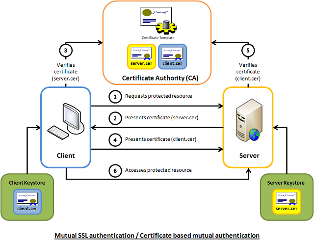
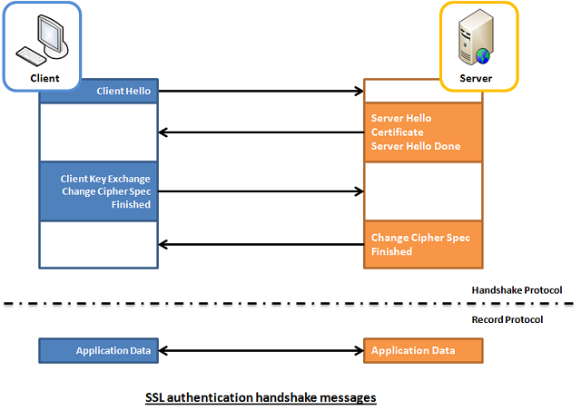
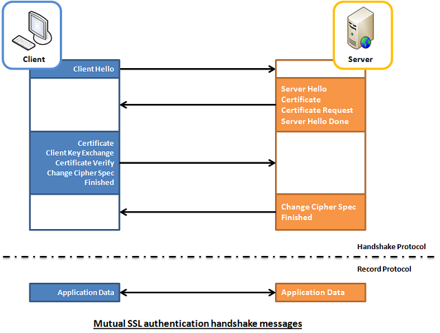
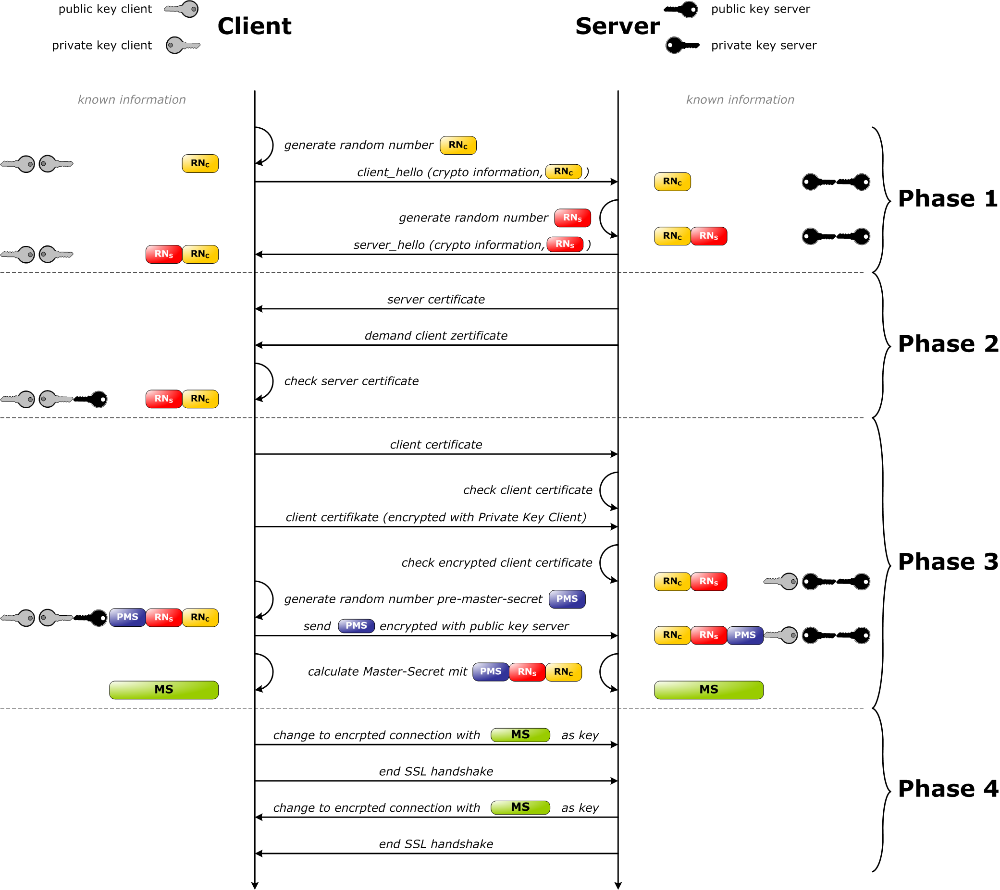

# HTTPS双向认证

最近持续1个月的HW终于结束了，在HW期间，部分系统开启了 **HTTPS双向认证**，之前并没有实际接触过，去了解了下大概原理，下面是转载其他大佬的文章，权当备份记录了。

作为开发人员，如果您有兴趣开发或能够有效地调试相互 SSL 身份验证，那么了解幕后发生的握手消息的复杂性会非常有用。本文着眼于 SSL 身份验证（服务器 --> 客户端）、相互 SSL 身份验证（服务器客户端），并有一个演示项目来帮助解释该理论。

## 简介

相互 SSL 身份验证或基于证书的相互身份验证是指两方通过验证所提供的数字证书来相互验证，以便双方确信对方的身份。用技术术语来说，它是指客户端（Web 浏览器或客户端应用程序）向服务器（网站或服务器应用程序）验证自己的身份，并且服务器也通过验证可信证书颁发的公钥证书/数字证书来向客户端验证自己[的](http://en.wikipedia.org/wiki/Certificate_authority)[身份](http://en.wikipedia.org/wiki/Digital_certificate)[当局 (CA)](http://en.wikipedia.org/wiki/Certificate_authority)。由于身份验证依赖于数字证书，因此 Verisign 或 Microsoft 证书服务器等证书颁发机构是相互身份验证过程的重要组成部分。从高层的角度来看，使用基于证书的相互身份验证来验证和建立加密通道的过程涉及以下步骤：

1. 客户端请求访问受保护的资源。
2. 服务器向客户端提供其证书。
3. 客户端验证服务器的证书。
4. 如果成功，客户端会将其证书发送到服务器。
5. 服务器验证客户端的凭据。
6. 如果成功，服务器将授予对客户端请求的受保护资源的访问权限。

## 背景

相互 SSL 身份验证的工作原理与 SSL（安全套接字层）身份验证类似，但还添加了使用数字签名的客户端身份验证。因此，SSL 身份验证和相互 SSL 身份验证也分别非正式地称为 1 向 SSL 身份验证和 2 向 SSL 身份验证。作为开发人员，如果您有兴趣开发或能够有效地调试相互 SSL 身份验证，那么了解幕后发生的握手消息的复杂性会非常有用。

### 单向SSL认证（服务器-->客户端）

在 SSL 身份验证中，客户端会收到服务器的证书，客户端计算机可能会尝试将服务器的 CA 与客户端的受信任 CA 列表进行匹配。如果颁发CA是可信的，客户端将验证证书是真实的并且没有被篡改。在这方面，客户端和服务器在消息交换之前都使用**9次**握手消息来建立加密通道。

1. 客户端发送`ClientHello `消息建议 SSL 选项。
2. 服务器响应`ServerHello `消息选择 SSL 选项。
3. 服务器发送`Certificate `消息，其中包含服务器的证书。
4. 服务器通过消息结束其协商部分`ServerHelloDone `。
5. 客户端在消息中发送会话密钥信息（使用服务器的公钥加密）`ClientKeyExchange `。
6. 客户端发送`ChangeCipherSpec `消息以激活它将发送的所有未来消息的协商选项。
7. 客户端发送`Finished `消息让服务器检查新激活的选项。
8. 服务器发送`ChangeCipherSpec `消息以激活它将发送的所有未来消息的协商选项。
9. 服务器发送`Finished `消息让客户端检查新激活的选项。

### 双向SSL认证（服务器<-->客户端）

而在双向 SSL 身份验证中，客户端和服务器都通过数字证书相互验证，以便双方都确信对方的身份。在这方面，客户端和服务器在消息交换之前都使用**12次**握手消息来建立加密通道。

1. 客户端发送`ClientHello `消息建议 SSL 选项。
2. 服务器响应`ServerHello `消息选择 SSL 选项。
3. 服务器发送`Certificate `消息，其中包含服务器的证书。
4. 服务器在消息中请求客户端的证书`CertificateRequest `，以便可以相互验证连接。
5. 服务器通过消息结束其协商部分`ServerHelloDone `。
6. 客户端回复`Certificate `消息，其中包含客户端的证书。
7. 客户端在消息中发送会话密钥信息（使用服务器的公钥加密）`ClientKeyExchange `。
8. 客户端发送一条`CertificateVerify `消息，让服务器知道它拥有所发送的证书。
9. 客户端发送`ChangeCipherSpec `消息以激活它将发送的所有未来消息的协商选项。
10. 客户端发送`Finished `消息让服务器检查新激活的选项。
11. 服务器发送`ChangeCipherSpec `消息以激活它将发送的所有未来消息的协商选项。
12. 服务器发送`Finished `消息让客户端检查新激活的选项。

> 上述原文链接：https://www.codeproject.com/Articles/326574/An-Introduction-to-Mutual-SSL-Authentication

看到这张图片，更加直观：https://commons.wikimedia.org/wiki/File:Ssl_handshake_with_two_way_authentication_with_certificates.png

## 相关资料

* [HTTPS 双向证书认证](https://blog.xizhibei.me/2021/02/03/https-two-way-authentication-with-certificates/)
* 

PS： 使用ChatGPT翻译，貌似并没有比Google翻译好多少，上面是Google翻译的结果。