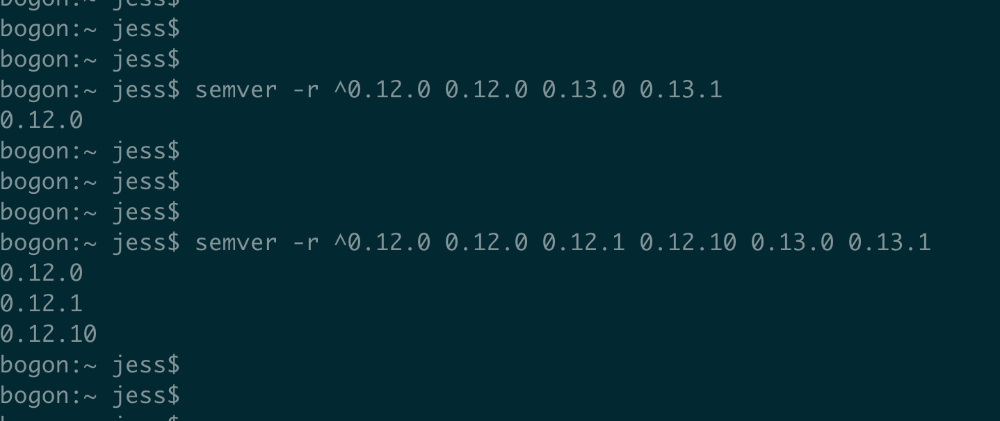

# npm install 版本号^的坑




`npm`中依赖版本号是 `^x.y.z`，可以包含哪些版本呢？


今天有同事遇到一个问题，我们代码里依赖的某个`npm`包，写的是版本是  `hard-source-webpack-plugin@^0.12.0`，但是在执行 `npm install` 的时候，安装的始终是 `0.12.0`这个版本，而不是这个包的最新版 `0.13.1` 。

刚开始，我还以为是因为有 `lock`的原因，比如有 `package-lock.json` 或者 `yarn.lock`，我认识是某个lock文件里，锁定了版本为 `0.12.0`。但实际情况是，由于之前同事的代码有点bug，虽然源码中的确是有`package-lock.json` 和 `yarn.lock`文件的，但是实际发版的时候，由于代码的bug，并没有将这两个文件发布到`npm`仓库里。

目前的情况就是，`package.json`里写的版本是 `^0.12.0`，这个包在 `npm`源的最新版是 `0.13.1`。但是通过npm安装出来，始终是0.12.0的，并不是0.13.1。

根据之前的理解，语义的版本是 `^0.12.0`，那么是可以覆盖到 **[major, minor, patch]** 三位版本中的 **后两位** 的，按理说应该会自动安装 0.13.1 这个版本啊。

难道是缓存的锅？嗯，有可能，npm的确是在本地有缓存的啊。于是清除掉本地的缓存 `npm cache clean —force`，再重新安装，WFT？还是 0.12.0 啊！！

看来不是缓存的锅。那是网络问题么？也不是，清除掉缓存都还是能安装到 0.12.0 ，网络肯定是OK的……

貌似，*客观原因* 都排查得差不多了……只能从 *主观方面* 找问题了。

版本号 `^0.12.0` ，真的包含了 `0.13.1` 么？？

再翻出 [npm版本官方文档](https://docs.npmjs.com/misc/semver#caret-ranges-123-025-004) 看看，嗯，之前的确理解错了。文档里明确说了，`^`指明的版本范围，只要**不**修改 **[major, minor, patch]** 三元组中，**最左侧的第一个非0位**，都是可以的。也就是说，要确定 `^`版本包含的范围，先要找到 **最左侧的第一个非0位** ，只有在这一位右侧的变动，才被包含在这个 `^` 指定的范围内。举个🌰：

* `^1.2.3`版本包括：>= `1.2.3` 并且 < `2.0.0`
* `^0.2.3`版本包括：>= `0.2.3` 并且 < `0.3.0`
* `^0.0.3`版本包括：>= `0.0.3` 并且 < `0.0.4`


同时，在官网还找到一个 `npm`命令行工具：`semver`，可以安装到全局：`npm i -g semver` ，之后，可以用这个工具来检查某个范围版本具体包含哪些，拿今天遇到的问题，就可以这样：

```shell
bogon:~ jess$ semver -r ^0.12.0 0.12.0 0.13.0 0.13.1
0.12.0
bogon:~ jess$
bogon:~ jess$ semver -r ^0.12.0 0.12.0 0.12.1 0.12.10 0.13.0 0.13.1
0.12.0
0.12.1
0.12.10
bogon:~ jess$
bogon:~ jess$
```


**PS** ：

我们目前在应用的代码里，为了防止某些包在升级过程中，没有遵循语义化版本，导致我们应用在每次打包后，生成的代码可能不同，一般都会用 `yarn.lock` 或者 `package-lock.json` 来锁定项目依赖的包的版本号。

但是上次有同学在开源的 **第三方包** 里，发现大多数都**没有** `yarn.lock` 或者 `package-lock.json`，感到有点奇怪，为什么这些开源的包，不锁定依赖的第三方版本呢？

我的理解，大概是这两个方面：

1. 都说`nodejs`的 `node_modules`是个比黑洞还深的坑，可见通常在我们一个应用里，会依赖多少的第三方开源包。每一个开源包，又会依赖很多别的包。如果每个开源包都锁定自己的依赖版本，那么很多底层的基础包，可能会被安装很多个，虽然只是 `patch` 部分存在版本差异，那前端代码打包之后，体积无疑会增大很多。因此，开源包为了和其他的开源包 **共享** 更底层的包，就不能锁定自己的版本
2. 其实第一点已经说明了问题，作为开源包的作者，可能也没有其他选择了，只能选择**相信** 其他的开源包作者，都会严格遵守 **语义化版本** 的要求


## 相关文档


* [npm语义化版本](https://docs.npmjs.com/misc/semver#caret-ranges-123-025-004)


​          ——时2019年5月16日 20:20 竣工于帝都五道口清华科技园