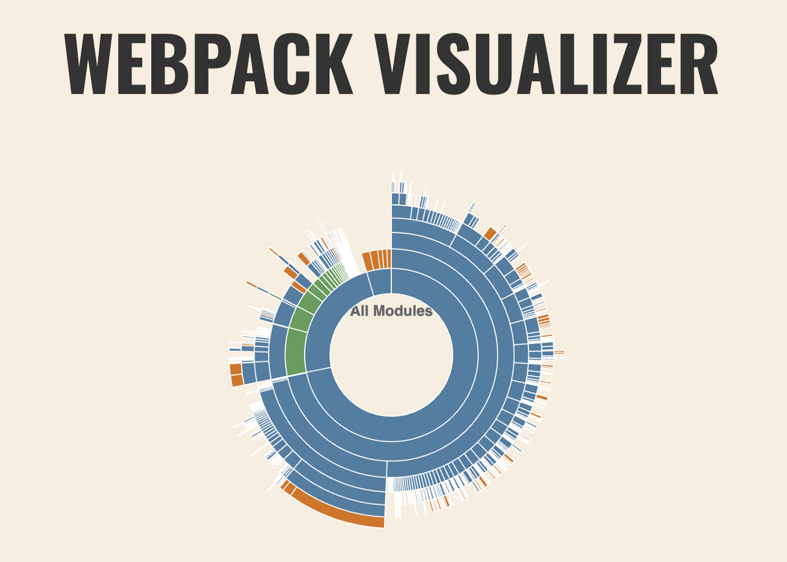
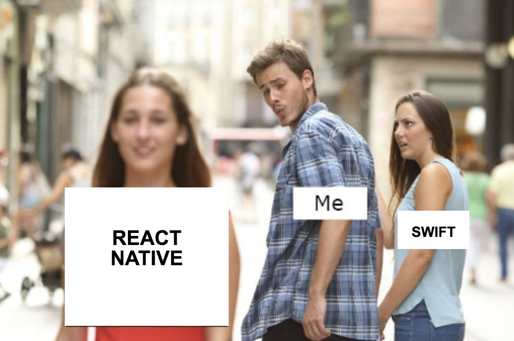

# [译]React Native性能优化指北

**译注**： 本文并没有详细的介绍具体的性能优化做法，作者给出的是一系列方法，需要我们自己根据实际情况，去采纳有用的一些点。

**原文链接**： [https://blog.usejournal.com/getting-started-optimizing-a-react-native-app-1d7507c2d849](https://blog.usejournal.com/getting-started-optimizing-a-react-native-app-1d7507c2d849) 

过去这一年，我都在持续地对一个业务规模庞大的银行APP进行性能优化。到目前，我们成功的在一台性能比较差的 华为P20 Lite 上，将 `TTI` 从14秒缩短到了2.5秒左右。下面是在这些性能优化中，我们总结出来的一些经验。

## 0. 找出问题所在

在性能优化过程中，一个常见的错误是，尝试一次搞定所有的性能问题。正确的做法是，找到一台性能比较差的Android机器，安装你的APP，进行一系列完整的业务操作，去感受你的APP在低端Android机上的性能表现如何。可以问问你自己，用户用你的APP最常用的一些功能？哪些操作路径，是关于用户体验的核心部分？

* 试试去掉所有动画 —— 你的APP运行的怎么样？
* 去掉网络请求，再来渲染你的页面 —— 你的APP还是慢吗？
* 试试删除某个组件 —— 页面渲染时间有没有显著提升呢？

找出页面渲染的所有相关逻辑，什么时候会执行网络请求，什么时候会渲染某些新的组件。只有当你找到导致APP性能问题的关键元素，你才有可能去修复它。

## 1. 性能测试，性能测试，还是性能测试

**译注**： 作者还真是重要的事说三遍啊。

每次做性能优化的时候，都需要测量你的某些改动，带来的影响。具体怎么来测量呢？使用一个秒表，使用 react-native-debugger ，或者其他的第三方工具？在 react native 性能测试中，没有银弹，每个人遇到的问题可能千差万别，因此，在你做出性能优化的改动前后，进行可靠的性能数据测试，是至关重要的。

我之前写过 [另一篇长文来讨论性能测试](https://medium.com/@vvvsejvvv/measuring-performance-reliably-in-react-native-is-easier-than-you-think-d7cc3d8df061) ，如果你感兴趣的话，你可以点过去看看 🎉。

## 2. 可视化你的bundle大小组成

[react-native-bundle-visualizer](https://github.com/IjzerenHein/react-native-bundle-visualizer)  是一个强大的工具，它可以用来分析你的bundle大小。看这个包名也知道，这个工具会执行react native 代码的打包，将最终bundle的大小可视化，并且可以查看bundle的大小具体来自哪些部分，是我们页面逻辑，还是来自 `node_modules` 。你可以看下，有没有一些文件或者npm包，占据了特别比较大的文件大小。[你真的需要 moment.js](https://github.com/you-dont-need/You-Dont-Need-Momentjs) 么，希望它不会占据你bundle大小的6%……

## 3. 只有当你用到的时候，才去加载对应代码/资源

**只有当要用到某部分代码的时候，才去加载对应代码** 

这是缩短APP首次启动时间最有效方法之一。在react native 项目里，代码懒加载超出了它本来应有的复杂度，但是这绝对值得我们去做。通过代码懒加载，我们的一个项目，即使在我们能找到的最慢的Android机器上，也将APP的启动时间从14秒缩短到了4秒！

[react native 官方性能优化部分](https://facebook.github.io/react-native/docs/performance)  是这方面最好的资源之一。

**延迟加载非关键的数据 ** 

你可能在很大APP里都看到过这个技术，通常在页面初始阶段，请求渲染首屏依赖的数据，在首屏展示之后，才去加载剩余部分的页面数据。[这个视频](https://www.youtube.com/watch?v=g3jwd0kAIDU&t=20m57s) 详细的讲解了这个技术。

## 4. 优化并且标准化图片资源

在react native项目中，通过很小的成本去优化静态资源(通常是图片)，就能获得比较大的性能提升。

为什么呢？每个设计师到处PNG图片的姿势可能是不同的，当你和多个设计师合作的时候，他们导出PNG图片的设置可能存在差异。

你可以使用一些软件，比如 ImageOptim ，去优化你的图片大小，甚至将整个流程自动化，就像 [这篇文章一样](https://medium.com/@vvvsejvvv/are-you-automatically-optimizing-your-assets-in-react-native-because-you-should-fd6c06fc2c2b) 。

## 5. 善于利用感知性能

性能优化，并不只是追求缩短代码执行时间，我们最终的目的，是让用户在使用APP的时候，感觉到流畅。感知性能优化，是你能利用的一个技巧，来让用户感觉APP运行的很快、很流畅。有一些方式，比如 [让用户停留在欢迎界面，直到JavaScript代码加载完成](https://github.com/crazycodeboy/react-native-splash-screen) ，或者使用  [react-native-shimmer](https://github.com/oblador/react-native-shimmer) ，都可以优化用户感知性能。

## 6. 尽可能的使用开源组件，并保持他们是最新版

在我工作过程中，我意识到了一个比较尴尬的事情，作为APP开发者，我们基本上不可能写出比开源组件更好的代码。成千上万的开源软件贡献者、他们拥有的完整的测试设备以及开源作者的知识水平，大多数情况下，都远远超出了我们公司或者小组的成员。

在过去的两年里，react native社区都在集中精力进行性能优化，特别是核心团队最近的几次大的升级，在 0.59 版本升级 [JSC](https://facebook.github.io/react-native/blog/2019/03/12/releasing-react-native-059) ，在 0.60.2 版本发布了 [Hermes](https://facebook.github.io/react-native/docs/hermes) 。

## 7. 重写你的动画

动画卡顿，通常更容易让用户察觉到APP的性能问题。在JS线程执行动画，很容易引起性能问题，导致动画的卡顿。相反，将动画交给native线程来运行，能避免这个问题。大多数的动画，都可以使用 `Animated` 并且设置 `useNativeDriver:true` 来实现。

## 8. 避免过早的优化细节

**译注** ：作者应该就是让我们抓住问题的主要矛盾，先解决 二八原则 中的 80% 部分。

细小的点，通常不是引起APP性能问题的罪魁祸首。

## 9. 性能优化：痛并快乐着

APP性能优化需要持续的投入很多精力，这和APP架构不太一样——但是，性能优化的过程，也让我们有机会对react内部的机制有了更好的理解。

希望你喜欢这篇文章 🎉。

## 推荐阅读

我强烈推荐 [这个react native性能优化的视频](https://www.youtube.com/watch?v=g3jwd0kAIDU) ，它非常实用，很容易结合我们实际情况进行实践。react native 官方团队的 [react native性能优化](https://facebook.github.io/react-native/docs/performance?source=post_page---------------------------) 非常值得学习。

