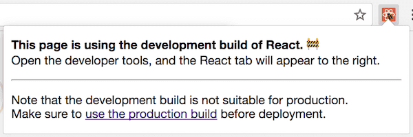

#[译]JavaScript中的development模式怎么实现


**原文链接**： [https://overreacted.io/how-does-the-development-mode-work/](https://overreacted.io/how-does-the-development-mode-work/) 

**译注**： 忽略了一些内容，还是强烈建议阅读下原文吧。


随着你的 `JavaScript` 应用越来越复杂，你很可能会在 `development` 和 `production` 模式下，分别加载和执行不同的代码逻辑。

能够在 `development` 和 `production` 模式下，分别打包或执行不同的代码，是一种非常强大的能力。在 `development` 模式下，`React` 会给出关于你代码的一些警告，通常情况下，这些代码很可能会导致bug。但是，去提前监测并给出警告的这些代码，也增大了打包之后的JS文件大小，甚至会降低应用的性能。 

在开发阶段，我们可以接受因为额外的监测代码而导致的应用性能损耗。事实上，在开发中，代码运行比production模式更加缓慢，甚至可能带来一些好处，这让开发者能体会到在一些性能低下的设备上，我们应用的运行效果，正如你知道的，通常开发者的机器性能是优于大部分的用户设备。

在 `production` 模式下，我们不能忍受这些额外的监测代码带来的性能损耗。因此，在 `production` 模式下， `React` 不会包含这些监测代码。下面让我们来看看具体是怎么做到的。


-----

实现 `development` 和 `production` 模式执行不同的代码，这依赖于你的JS代码编译流程(当然前提是你有JS编译流程……)。在Facebook，我们大概这样写代码：

```javascript
if (__DEV__) {
  doSomethingDev();
} else {
  doSomethingProd();
}
```

上面代码里，`__DEV__` 不是一个真实存在的变量。它在JS代码编译阶段，会被一个常量来替换，通常在 `development` 下是 `true`，在 `production` 模式下是 `false`。在不同模式下，编译出来的最终代码长这样：

```javascript
// In development:
if (true) {
  doSomethingDev(); // 👈
} else {
  doSomethingProd();
}

// In production:
if (false) {
  doSomethingDev();
} else {
  doSomethingProd(); // 👈
}
```

在 `production` 模式下，你通常会使用一些压缩工具(比如 [terser](https://github.com/terser-js/terser) )来压缩JS代码。同时，大多数的JS代码压缩工具，都会进行一些 [死码消除](https://en.wikipedia.org/wiki/Dead_code_elimination) ，比如在生成的代码中，删除掉 `if(false){}` 这样的代码分支。 因此，在 `production` 模式下，经过压缩之后，最终产出的代码长这样：

```javascript
// In production (after minification):
doSomethingProd();
```

你在实际项目中，用到的可能并不是 `__DEV__` 这个标记常量，如果你用的是 `webpack` 这样的JS编译打包工具，那通常用的是另外一种常量标记方式，来实现这个功能。比如，在 `webpack` 社区中，通常是这样来区分 `development` 和 `production` 的代码分支：

```javascript
if (process.env.NODE_ENV !== 'production') {
  doSomethingDev();
} else {
  doSomethingProd();
}
```

当你使用一些打包工具(比如webpack)来从 `npm`包的引入 [React](https://reactjs.org/docs/optimizing-performance.html#use-the-production-build)、[Vue](https://vuejs.org/v2/guide/deployment.html#Turn-on-Production-Mode) 这样的类库时，这些类库里区分 `development` 和 `production` 的方式和上面这段代码是一样的(**译注**： 通过 `process.env.NODE_ENV` 来区分不同模式，应该是 `web`前端开发中的一种约定了吧)。如果你是通过 `<script>`标签的方式，来直接加载已经提前编译好的版本，那么通常是以JS代码的文件后缀 `.js` 和 `.min.js` 来区分 `development` 和 `production` 模式的代码。

通过 `process.env.NODE_ENV` 标记来区分 `development` 和 `production`环境的约定，最初是来自于 `Node.js`。在 Node.js 中，有一个全局变量 `process`，并且可以通过 `process.env` 这个对象来访问到代码执行时候的环境变量。但是，在前端代码(**译注**：指运行在浏览器里的那种JS代码)里，并不存在全局的 `process` 变量🤯。

实际上，类似我们前面提到的 `__DEV__`，`process.env.NODE_ENV` 也是在代码编译阶段会被 `development` 或者 `production` 常量替换掉。替换之后的代码如下： 

```javascript
// In development:
if ('development' !== 'production') { // true
  doSomethingDev(); // 👈
} else {
  doSomethingProd();
}

// In production:
if ('production' !== 'production') { // false
  doSomethingDev();
} else {
  doSomethingProd(); // 👈
}
```

从上面可以看出，替换之后， `if` 里的表达式是不变的(`'production' !== 'production'`的值永远都是 `false` )，代码压缩工具能够移出掉对应的分支代码。最终 `production` 模式下，压缩之后的代码是这样的：

```javascript
// In production (after minification):
doSomethingProd();
```


----

**注意**，如果表达式变得比上面复杂，代码压缩工具 **不会** 删除掉那些死码。看下面这个栗子： 

```javascript
let mode = 'production';
if (mode !== 'production') {
  // 🔴 not guaranteed to be eliminated
}
```

由于JavaScript语言本身的动态特性，JS代码的静态分析工具不是太智能。当静态分析工具在遇到一个变量(比如是 `mode` )时，他们通常什么也不会做。只有当他们遇到明确的常量表达式(比如 `false` 或者 `'production' !== 'production'`)时，他们可以大胆的移出对应的代码分支。

相似的，JavaScript压缩工具的的死码删除功能，在面临跨模块引用时，也不会生效，比如下面的例子： 

```javascript
// 🔴 not guaranteed to be eliminated
import {someFunc} from 'some-module';

if (false) {
  someFunc();
}
```

因此，想要利用JavaScript压缩工具的死码删除功能，你必须确保条件语句是常量，没有包含变量，并且对应的分支代码必须是在同一个 `module` 内部。


------

要实现这些功能，你的JavaScript打包工具需要根据你的编译环境(`development` 或者 `production`)来替换 `process.env.NODE_ENV`。

在几年以前，开发者尝尝会忘记在编译 `production` 包时设置对应的模式，这导致很多 `development`模式下编译的 `React` 代码在生产环境被使用。

在生产环境使用 `development`模式下的代码，会增加我们的JS文件大小，减慢页面加载速度以及最终的代码执行性能。

在过去的两年，这种情形有所缓解。比如，`webpack`引入了一个简单的 `mode`配置项，来避免开发者手动去设置 `process.env.NODE_ENV`的值。React开发者工具，在检测到页面使用了 `development`模式的React代码时，会显示一个红色的图标，这让我们很容易就察觉问题。




一些流行的代码初始化工具，比如 Create React App，Next/Nuxt，Vue Cli，Gatsby等等，直接将`development` 和 `production`模式下的打包命令分成2个(比如开发模式是 `npm start`，生产环境使用 `npm run build`)，进一步避免开发者去手动设置变量。通常来讲，只有 `production`模式产出的代码，会被部署到生产环境，因此，开发者不会再遇到以前的问题了。

一直以来都有一些争论，认为应该把 `production` 模式设置为编译工具的默认模式，`development`模式成为需要开发者明确指定的。我个人认为，这个观点不是很有说服力(**译注**：我个人认为默认是 `production`模式比较好😅)。那些能够从 `development`模式下的各种警告信息收益的开发者，通常是使用类库的新手。他们可能并不知道怎么开启 `development`模式，由此可能会遇到很多本来可以被那些警告信息所避免的bug。

诚然，`development`模式的代码性能比较低，可能会让一些开发者苦恼；但这也比发布带有bug的功能要强。举个例子，[React 列表的 key 警告](https://reactjs.org/docs/lists-and-keys.html#keys) 能够帮助开发者避免一些bug，比如发送了一条消息给错误的对象，或者购买了另一个商品。如果在开发过程中，没有这些警告信息，开发者很难在开发阶段就发现并解决一些潜在的bug。如果这些警告信息是默认关闭的(默认开启 `production`模式的话)，当你在某个时刻，切换到 `development` 模式时，你讲看到太多的警告信息，这可能让你不太想去修复这些问题。不修复问题，警告信息又太多，怎么办呢，大多数开发者可能会关闭警告，重新设置为 `production` 模式。这就是为什么，`development`模式应该是默认开启的，这让开发者可以一步步的发现并修复警告，而不是突然面对一堆的警告信息变得无所适从。

如果`development`模式是可选的，并且开发者在初始时候就打开了 `development`模式，我们就又回到了最初的那个问题：一些开发者可能会忘记在上线的时候，切换到 `production`模式，从而将 `development`模式的代码发布到了生产环境。


------


嗯，理论的东西说完啦(终于)

让我们再来看看这段代码：

```javascript
if (process.env.NODE_ENV !== 'production') {
  doSomethingDev();
} else {
  doSomethingProd();
}
```

你可能想知道：既然前端代码中，根本就不存在全局的 `process` 对象，为什么通过 `npm` 包引入的 React/Vue 这些类库，还要去依赖 `process.env.NODE_ENV`呢？

(再次说明下：如果你选择的是直接通过 `<script>`标签引入已经提前编译好的代码，你需要根据文件后缀 `.js` 还是 `.min.js` 来手动选择 `development`版本还是`production`版本。后文要讲的，都是从 `npm` 包经过打包工具来引入 React/Vue 的场景！)

和软件编程领域的很多事情一样，采用 `process.env.NODE_ENV`来标记不同环境，是历史原因。我们继续遵守这个约定，仅仅是因为它已经广泛地被大多数工具支持。换一个别的标记，没有太大意义，也没有社区工具的支持。

那么这段背后的历史是什么呢？

在 `import` 和 `export`被加入JS语言标准之前的很多年，存在好几个相互竞争的JS模块化方案。Node.js 采用了来自 [CommonJS](https://en.wikipedia.org/wiki/CommonJS) 的 `require()` 和 `module.exports`。

最初发布到 `npm` 上的包，都是给 Node.js 使用的，并不是给前端代码用的。作为曾经是(或许现在也是？)最流行的 Node.js 服务端框架，[Express](https://expressjs.com/) [使用NODE_ENV这个环境变量](https://expressjs.com/en/advanced/best-practice-performance.html#set-node_env-to-production) 来开启 `production`模式。在这之后，其他的一些 `npm`包也采用了 `process.env.NODE_ENV` 来区分不同环境。

像 browserify 这样的早期JavaScript代码打包工具希望能在前端工程中，引入 `npm` 包提供的代码。(是的，[那时候](https://blog.npmjs.org/post/101775448305/npm-and-front-end-packaging) 几乎没有前端开发者使用npm来发布自己的代码，你能想象到吗？) 。因此，这些早期的打包工具采纳了 Node.js 生态中已经广泛采用的约定，使用 `process.env.NODE_ENV` 来区分不同环境。

从 React 发布的那天起，在提供预编译好的JS代码之后，React 还提供了对应的 `npm`版本。伴随着 React 的流行，越来越多的前端开发者也基于 CommonJS 的方式来发布前端代码到 npm 仓库。

React 需要在 `production` 模式中移出掉 `development`模式下的一些代码。正好 Browserify 对这个问题有了解决方案，因此 React 也采用了这个方案，在 npm 包中通过 `process.env.NODE_ENV`来区分不同环境。到后来，越来越多的类库和工具，比如 Vue 和 webpack，都采纳了这个方案。

到2019年，browserify 已经不再流行。但是，在JavaScript代码编译阶段，将 `process.env.NODE_ENV` 替换成 `development` 或 `production` 继续像之前一样被社区广泛采用。


------

还有一个事情，可能会让你困惑。在 React 的 Github 源码中，你会发现 `__DEV__` 这样的环境标记。但是在 npm 上的 React 代码里，使用的却是 `process.env.NODE_ENV`。这是神马情况呢？

由于历史原因，为了和 Facebook 内部代码保持一致，我们使用了 `__DEV__` 这个标记。在很长的一段时间里，React 代码都是直接被拷贝到 Facebook 的代码仓库，因此需要遵守相同的规则。因此，在发布到 npm 之前，我们会有一个替换步骤，将 `__DEV__` 替换为 `process.env.NODE_ENV !== 'production'`。

在一些场景下，这会导致问题。一段基于 Node.js 约定的代码，在 npm 下运行的很好，但是在 Facebook 内部却出错；或者是相反的问题。

因此，从 React 16 开始，我们做出了一些调整。针对每个环境(包括 `<script>`引入的预编译代码，npm，以及 Facebook内部仓库)，我们都会 [编译对应的bundle](https://reactjs.org/blog/2017/12/15/improving-the-repository-infrastructure.html#compiling-flat-bundles) 。

这意味着，针对 React 中的源码 `if (__DEV__)` ，我们实际上针对每个包都会生成2个bundle：一个是设置了 `__DEV__ = true` 编译出来的bundle；另一个是设置了 `__DEV__ = false` 编译的bundle。

[举个例子](https://unpkg.com/browse/react@16.8.6/index.js)：

```
if (process.env.NODE_ENV === 'production') {
  module.exports = require('./cjs/react.production.min.js');
} else {
  module.exports = require('./cjs/react.development.js');
}
```

 这个入口JS，是惟一一处你的打包工具需要替换 `process.env.NODE_ENV` 的地方，也是在这个入口JS，打包工具会忽略掉 `development`的 `require`。

`react.production.min.js` 和 `react.development.js` 两个文件中，都 **没有** 包含 `process.env.NODE_ENV` 这样的检查代码。这很好，因为在 Node.js 里访问 `process.env` 是 [有些慢的](https://reactjs.org/blog/2017/09/26/react-v16.0.html#better-server-side-rendering)。提前编译好两个模式下的 React 代码，也能让我们的最初JS文件大小，不管我们使用哪个打包工具，都 [更加的一致](https://reactjs.org/blog/2017/09/26/react-v16.0.html#reduced-file-size)。


------


根据运行环境执去执行不同的代码，是一项非常强大的技术。我推荐你在你的类库或者APP代码中，也使用这个技术，只在 `development`模式下去做一些消耗性能的校验和警告，在 `production`模式下移除这些代码。


**再次说明**： 有一些片段没有搬过来，强烈推荐看看原文！


**原文链接**： [https://overreacted.io/how-does-the-development-mode-work/](https://overreacted.io/how-does-the-development-mode-work/)


