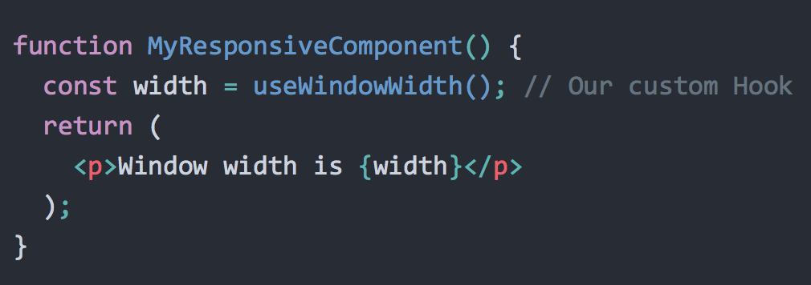
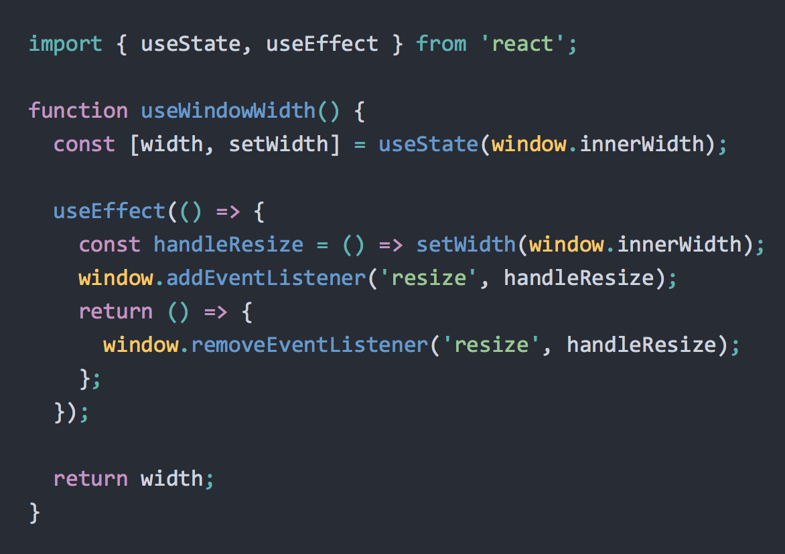
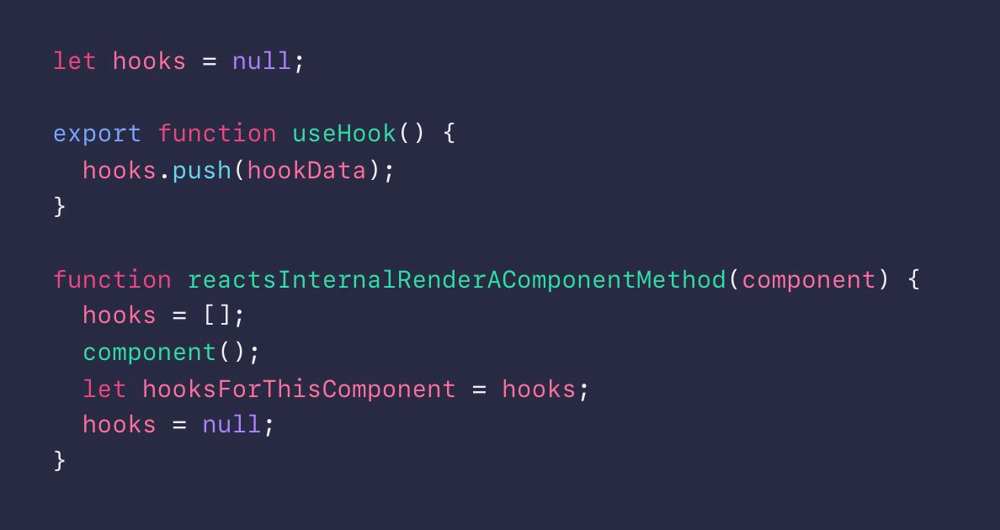

# [译]进一步了解React Hooks

**原文** : [https://medium.com/@dan_abramov/making-sense-of-react-hooks-fdbde8803889](https://medium.com/@dan_abramov/making-sense-of-react-hooks-fdbde8803889)

**译注**：原文中有些内容，包括了非死不可、Twitter的内嵌内容，在本文里**没有**包括上。强烈建议阅读原文！

**这篇文章同样发布在了DEV社区上，点击这里 [https://dev.to/dan_abramov/making-sense-of-react-hooks-2eib](https://dev.to/dan_abramov/making-sense-of-react-hooks-2eib) 可以看到**

## 为什么引入Hooks

我们知道，组件化以及自上而下的数据流，有助于我们将大的UI界面，拆分为小的、相互独立的、可服用的单元。**然而，我们经常发现，我们不能将一些复杂的组件拆分得更细，因为这些组件通常混合了逻辑和state，导致我们很难进一步的拆解出函数或者更细粒度的组件**。有的开发者说，使用react并没有实现"关注分离"，在上面这样复杂的带逻辑和state的组件下，确实是这样的。

这种情况很普遍，包括动画，form表单处理，外部的数据源以及很多我们希望在组件里实现的功能。当我们希望通过组件来解决这些情况时，通常会有以下几种办法：

* **什么也不做**，保持一个复杂的大的组件，这给维护、测试都带来很大困难。
* **重复逻辑**，在多个组件里都重复写相同的逻辑，或者在多个生命周期方法里重复相似的逻辑
* **复杂的模式**，比如 `render props`，以及经常见到的高阶组件(`HOC`)

我们认为，hooks是我们为了解决上面这些问题，而做的一次最佳的尝试。**hooks允许我们把一个复杂组件内部的逻辑，重新组织为多个可复用的、彼此隔离的单元模块**。

**除了组件之间，在组件内部，hooks也很好的践行react开发哲学(包括显式的数据流，优先使用组合)**。因此，我认为hooks是对react组件模型的一次很好的补充和完善。

一些常见的开发模式，比如 `render props` 和 高阶组件，都会在我们应用的组件树中，引入不必要的层级嵌套；使用hooks，却不会引入这些多余的层级。hooks同样避免了使用 [mixins的缺点](https://reactjs.org/blog/2016/07/13/mixins-considered-harmful.html#why-mixins-are-broken)。

对于hooks，你第一反应可能会觉得很怪异(我当时也这样)，但我仍然鼓励你去试试hooks。我相信，你会喜欢上hooks的。

## Hooks使React变臃肿了么？

在我们仔细了解hooks之前，你可能会觉得，我们只是给react引入了一些新的概念——hooks。嗯，这个想法有一定的道理。我认为短期上为了学习适用hooks，肯定会引入一些学习成本，但是长期来看，这些付出是值得的。

**如果react社区能够拥抱hooks，它将会大大减少我们在开发react组件过程中，不得不使用的各种hack**。hooks让你能够只写函数组件，而不是纠结应该用 `class`组件，函数组件，或者 `render props`这样的技术。

具体到实现层面，引入hooks只给react包大小增加了 1.5KB(gzip压缩后)。这个大小其实很小了，同时在另一个方面，实践表明，**引入hooks可以减小你的代码量**，因为和基于 `class`的组件相比，使用hooks的函数组件，代码压缩效果更好。下面这个例子，效果有点夸张，但是它也能够有效的表明，引入hooks为什么能减少代码量。

**译注**：原文没看到具体的例子，只有一个这个链接  [ [@jamiebuilds](https://twitter.com/jamiebuilds/status/1056015484364087297)](https://twitter.com/jamiebuilds/status/1056015484364087297) 。

hooks并没有给react带来不兼容的升级。你的老代码能照常运行，你也可以在新的组件中，引入hooks，新老组件可以并存，都不会有任何问题。事实上，这正是我们推荐的做法——不要基于hooks大规模的重写老的代码！我们推荐在**新的组件**里，使用hooks来开发。

## 到底什么是Hooks？

为了更好的理解hooks，我们需要回顾一下，日常开发中的**代码复用**。

目前，在react应用里，有很多逻辑复用的实现方法。我们可以封装一些简单的函数，在组件里调用这些函数。我们也可以开发组件来复用，不管这些组件是函数组件还是类组件。通过组件来复用逻辑的方法，更加强大，但是组件，通常对应着的UI界面；这就使得组件，不适合用来复用与UI无关的逻辑。为了复用逻辑，社区引入了 `render props` 和高阶组件。**如果能有一个通用的方法来实现代码复用，那react不就更简单易用了吗**？

函数看上去是一个很好的代码复用机制。在函数之间重构逻辑代码，成本也比较低。然而，函数内部，不能拥有react的state。要想在类组件里抽取出逻辑代码，比如"window大小改变的时候，更新state"，或者"执行时间相关的动画"，你只能重组你的组件代码，或者引入独立的一层，比如Observables。这些方法，都让我们的react代码变得更加复杂。

hooks就是为了解决这个问题的！hooks允许你在函数内部，仅仅是调用另一个函数(比如`useState`)，就能在函数内部，利用react类组件的很多特性，比如 `state` `componentDidMount`等。react内置了一些基本的hooks，来利用react组件的基础能力，比如：`state` ，生命周期函数，`context`等。

因为hooks只是普通的JavaScript函数，你当然可以通过组装调用内置的hooks，来实现自定义的hooks。这就允许我们，将复杂的逻辑拆解为一系列小的逻辑单元，并且在我们APP内部或者react社区去复用他们。

注意，技术上来讲，自定义hooks都算不上一个react特性，hooks只是函数而已，自定义hooks只是普通的函数。

## 来点代码吧

OK，理论讲的够多了，还是来点干货吧，毕竟 "Talk is cheap, show me the code"嘛。假如我现在想在一个组件内，监听浏览器窗口大小的变化，比如在小窗口下，适配另一套样式。

你可能会想到好多种实现这个功能的方法，比如手写一个类组件，在 `componentDidMount`里监听事件；又或者，你提供一个通用组件，通过 `render props`或者高阶组件，在多个组件里复用这个逻辑。但是我想，没有代码可以比下面这样更简单(同时可复用)：

代码在这里： [https://gist.github.com/gaearon/cb5add26336003ed8c0004c4ba820eae](https://gist.github.com/gaearon/cb5add26336003ed8c0004c4ba820eae)

**仔细的看这段代码，它实现了上面我们所说的功能**。我们在组件里使用到了浏览器宽度width，当浏览器宽度改变的时候，会触发组件重新渲染。这就是react hooks的目标——不管组件有没有包含状态和副作用，我们都能够写出真正的声明式组件。

下面看下我们如何来实现这个自定义hooks。我们通过 `useState`来维护一个本地state，保存当前浏览器的宽度；同时通过 `useEffect` 来监听浏览器宽度变化，并且在浏览器宽度改变时，更新本地的state。

代码在这里： [https://gist.github.com/gaearon/cb5add26336003ed8c0004c4ba820eae](https://gist.github.com/gaearon/cb5add26336003ed8c0004c4ba820eae) 

正如你看到的，react内置的hooks，比如 `useState`  `useEffect`，是我们实现这些功能的基础。我们可以直接在函数组件内直接使用react内置hooks，我们也可以基于内置的hooks，封装出自定义的hooks，就像上面的 `useWindowWidth`。使用自定义hooks，和使用react内置的hooks没有任何区别。

你可以在[react官方文档](https://reactjs.org/docs/hooks-overview.html)，学习更多关于自定义hooks的知识。

**hooks是完全封装隔离的——每次调用一个hook，都会得到一个全新的state。** 

**译注：多个函数组件调用同一个hook，得到的state是完全不同的！没调用一次hook，都得到一个新创建的state！hook是复用逻辑，而不是复用state！！！**

hooks **不是** 用来复用state的，而是复用的**带state的逻辑**！我们不能够破坏自上而下的数据流。

每一个hook，都可以有自己的本地state和副作用。你可以在多个hook之间传递参数，就像调用普通函数那样。hooks可以接受参数并且返回值，因为他们仅仅是普通的JavaScript函数而已。

这是使用 react-spring 动画库基于hooks实现的一个动画demo：[https://ppxnl191zx.codesandbox.io/](https://ppxnl191zx.codesandbox.io/) 。

在源码里，我们在函数组件里，调用了3次 `useSpring`这个hook，并且后面的调用都依赖了前面调用返回的值：

源码地址：[https://codesandbox.io/s/ppxnl191zx](https://codesandbox.io/s/ppxnl191zx)

(如果你对上面的例子感兴趣，可以看看 [这篇文章](https://medium.com/@drcmda/hooks-in-react-spring-a-tutorial-c6c436ad7ee4))

尽管这不是引入hooks的主要目的，但hooks确实也让我们能够实现更强大的交互式debug工具。

可以在hooks之前随意的传递数据，使得我们更加容易实现一些功能，比如：表达动画，外部数据源监听，表单管理等状态管理。**不同于render props和高阶组件HOC，hooks不会在你的组件树里引入额外的层级**。hooks就像是一系列绑定到组件上的内存格子，里面存放着函数组件的state。

## 那么，类组件何去何从呢？

在我们看来，自定义hook，是react hooks特性中最吸引人的部分。但是，为了实现自定义hook，我们就需要在函数组件，找到一种方式，实现state和副作用(生命周期函数)。这些正是react内置的 `useState` `useEffect` 提供的作用。你可以到 [react官方文档](https://reactjs.org/docs/hooks-overview.html) 了解这些hook。

事实表明，这些内置的hook，不仅仅对开发自定义hook有用。他们对开发函数组件也很有效，因为他们提供了很多类组件才有的特性，比如 `state`。这就是为什么，我们希望在将来的react组件开发中，hooks成为主要的组件开发方式。

我们**没有**计划废弃类组件。在非死不可，我们有成千上万的类组件，就像你一样，我们没有动力去使用hook重写这些组件。但是，如果react社区接受了hooks，那么就没有必要在开发组件上，还推荐2种写法(类组件和基于hooks的函数组件)。react hooks在代码拆分、测试以及复用方面，都提供了比类组件更好的灵活性。这就是为什么我们认为react hooks是未来react组件的写法。

## Hooks看上去太神奇了

你可能被惊呆了，如果你看过 [Rule of Hooks](https://reactjs.org/docs/hooks-rules.html) 。

**尽管hooks只能在函数组件最外层调用看上去不太寻常，你可能也不会在 if/else 条件里去定义你的state。**举个例子，你同样不能在类组件里有条件的定义state，在过去几年和react开发者交流中，还没有开发者抱怨过这个。

这些设计原则很关键，它让我们在不引入新的语法或者hack的情况下，可以自由的组装开发自定义hook。我们知道在刚开始很难接受这些原则，但是为了获得hooks提供的更多好处，这些小小的付出是值得的。如果你不同意我所说的，我建议你在实践中去尝试下hooks，我相信，实践会改变你的看法。

我们已经在生产环境里使用hooks几个月了，我们也想看看有没有工程师会被这些规则困扰。在实战中我们发现，开发者通常指需要几个小时就能适应这些规则。我个人看来，这些规则在第一眼看上去，"感觉是错的"，但很快我就适应了。这个经历就像是我对react的感受。(第一眼看到react，你就喜欢上了么？我是第二次尝试之后才喜欢上的。)

其实，在react hooks的实现里，也没有什么黑魔法。正如  [Jamie 指出的](https://mobile.twitter.com/jamiebuilds/status/1055538414538223616)，hooks内部实现，简化之后大概就是下面这样： 

代码地址：[https://gist.github.com/gaearon/62866046e396f4de9b4827eae861ff19](https://gist.github.com/gaearon/62866046e396f4de9b4827eae861ff19)

在react内部，针对每一个组件，我们保存了一个对应的hooks列表，每当一个hook被使用，我们就把hook指针移到列表下一个。正是由于上面的规则限制，每次render过程中，hooks的顺序都是固定不变的，我们才能够针对每个hook调用都返回正确的状态。别忘了，react不需要什么额外的工作就能知道当前正在渲染的组件——因为正是react框架在负责调用你的组件。

[这篇文章](https://medium.com/@ryardley/react-hooks-not-magic-just-arrays-cd4f1857236e) 针对hooks有一个可视化的解释。

或许你在想，react是在哪里维护hooks的内部状态。答案很简单，hooks的内部状态和类组件的state保存在同一个地方。react内部维护了一个更新队列，所有的state都在这个队列里，不管你是通过类组件或者hooks来定义你的state。

不同于一些常用的JavaScript类库，hooks **不依赖** `Proxy` 或者 `getter` 这样的语言特性。按理说，react hooks还没有一些常用的JavaScript类库那样神奇。要我说，react hooks就像是调用 `array.push` 和 `array.pop` 这样的方法一样平常。(同样，这两个方法的调用顺序也很重要)

hooks升级并不仅仅局限在react本身。事实上，在hooks提案公开后的几天里，就有开发者把hooks的API实现移植到了 Vue ，Web Component，甚至原生的JavaScript函数里。

## Spread Love, Not Hype

如果react hooks仍然对你没有吸引力，我能够理解。我还是希望你能够在一些小项目上，尝试下react hooks，试试那样会不会让你爱上hooks。如果你没有经历过react hooks尝试解决的那些问题，或者针对这些问题你有更好的想法，请在 RFC 里告诉我们。

如果我的讲解让你对react hooks很兴奋，或者有那么一点点好奇，我就很满足了。目前react有那么多的开发者，如果我们忙着写各种hooks教程，以及强调这是未来react开发的最佳实践，开发者很容易感到困惑，毕竟react hooks刚出来不久。甚至在我们react团队内部，对于hooks也还存在一些疑问。

## 下一步肿么办

建议先研读官方文档，来学习react hooks的相关知识：

* [Hooks介绍，为什么要引入hooks](https://reactjs.org/docs/hooks-intro.html)
* [hooks第一次使用](https://reactjs.org/docs/hooks-overview.html)
* [创建自定义hook，这才是最有趣的](https://reactjs.org/docs/hooks-custom.html)
* [hooks FAQ](https://reactjs.org/docs/hooks-faq.html)

**译注**：翻译中有删减，还是**强烈建议阅读原文**！

​            ———时2019年4月7日 17:10 竣工于帝都望京