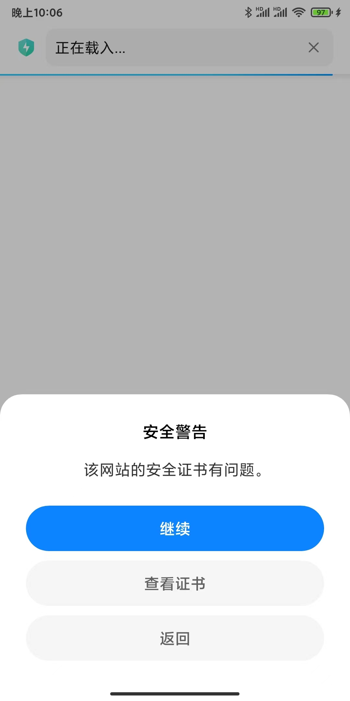
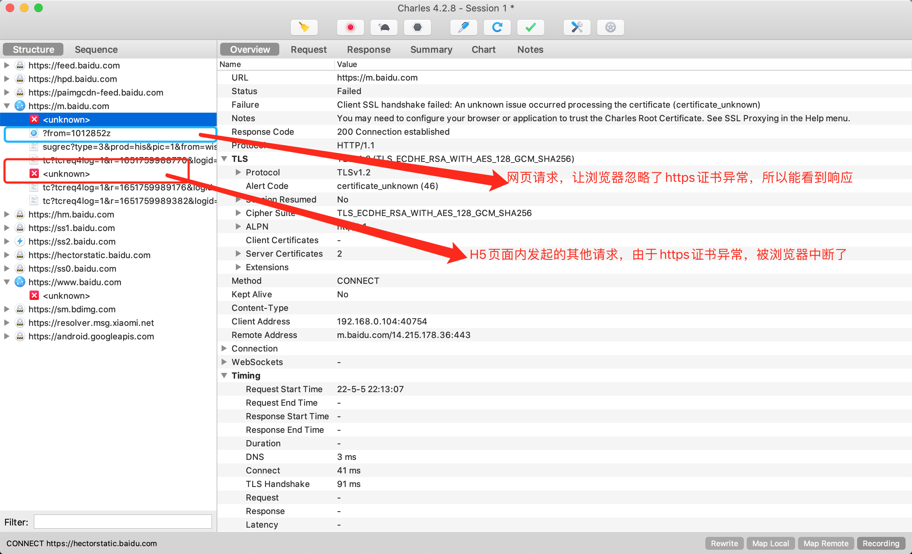
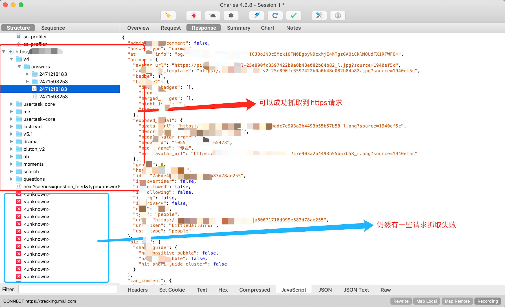

# 抓包工具Charles使用简介


在PC端开发中，我们可以使用 Chrome 开发工具里的 `Network` 面板，直观地看到各种资源的网络请求，包括请求头、请求体、参数，响应头、响应body等，这对我们定位页面里异常问题有很大帮助，可以直接确认是否网络数据导致的。

有的时候，我们需要抓取手机上的网络请求，比如这些场景：

* 生产H5（或者原生APP）异常，需要确认是否Ajax接口导致
* 分析竞品的交互流程，甚至具体的技术实现细节
* 爬去某些特定APP的数据

在windows上，一般用 `fiddler`  抓包工具，在 macOS 上，通常是 `Charles` 这个工具。下面就以 `Charles` 为例，说明在电脑上抓取手机网络的一些基本方法。


## 准备工作

一般情况，我们要在PC电脑上抓手机的网络请求，要先进行如下准备：

1. 安装对应平台的抓包工具，比如上面的 `fiddler` 或者 `Charles` （显然……）
2. 将电脑和手机连接同一个WiFi局域网
3. 启动电脑上抓包工具，开启代理服务
4. 在手机端，设置WiFi的代理，包括 **IP地址** 和 **端口** ，IP地址就是电脑的 **局域网IP** ，端口就是对应抓包工具使用的端口
5. 如果需要抓的是 **https** 请求，还需要在手机上，安装对应工具的 **https证书** （这一步在Android和iOS上操作会有区别，通常按照对应的抓包工具文档操作即可）


## 抓包实战


按照准备工作里的步骤，我的手机已经设置了WiFi代理，到电脑上的Charles上。打开手机自带浏览器，访问 *https://m.baidu.com/* ，手机浏览器会提示 https证书异常 ，如下：



点击 【继续】 之后，可以打开百度页面，同时，在Charles中能看到页面这次https的请求和响应，但是对其他一些资源，仍然报错，如下：



对于没有成功抓取的https请求，Charles已经在界面里说明了，注意看右侧那个 【Notes】 ，有提示我们怎么解决失败的https请求抓包问题。

根据上面的说明，重新在手机上安装了Charles的https证书（我之前已经安装过），再来看抓包情况，浏览器还是会报 https证书异常！在 [Charles官网文档里，可以找到答案](https://www.charlesproxy.com/documentation/using-charles/ssl-certificates/) ，这是由于从 `Android 7` 开始，操作系统提高了安全性，不再信任用户导入的https证书了，如果某些APP信任某些证书，必须在APP的代码配置里声明，这也就意味着，不能像以前一样肆意对其他APP抓包了……

**Android高版本抓包问题** 

针对这种情况，网上有一些方案解决，比如手机root（这个太高危，不划算），另外就是 Charles + VirtualXposed + JustTrustMe 组合完成。大概安装步骤如下：

* 在 https://github.com/android-hacker/VirtualXposed 下载最新的APK

* 在 https://github.com/Fuzion24/JustTrustMe 下载最新的APK

* 通过USB安装上述两个APK到Android手机：

  * ```shell
    adb install ./VirtualXposed_0.20.3.apk
    adb install ./JustTrustMe.apk
    ```

* 参照 https://github.com/android-hacker/VirtualXposed 文档，在Android手机上安装要抓包的APP，并通过 `VirtualXposed` 打开

以某APP 为例，通过上面操作之后，可以正常抓到 **大部分** https请求，当*仍然有部分请求抓取失败*（没看出是什么原因），




## 小结

本文简单介绍了在 macOS 系统下，通过 `Charles` 工具来抓取手机网络请求的过程，通常 **http请求** 不会有问题，在 `Android`高版本上，我们遇到了https证书不合法的问题，需要通过 `VirtualXposed` 和 `JustTrustMe` 这两个工具配合，才能抓取到APP内的https请求（仍然会有部分请求抓取失败）。

至于 `iOS` 上抓包，以及 `windows` 电脑上的 `fiddler` 工具使用，和 `Charles` 类似，就不再赘述了。


## 参考文档

* https://cloud.tencent.com/developer/article/1751324 

