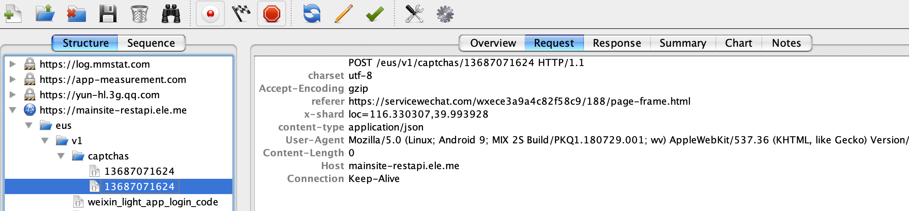

# 微信小程序-图形验证码实现

最近有同事在调研微信小程序，准备把我们的 `landing page`(LP)页面，迁移到小程序里，提高用户体验，提升转化率。

在LP里，遇到个很常见的问题，用户通过手机号注册，发送短信验证码需要防刷，目前在 `h5` 上使用的是 图形验证码+极验。一上来，就遇到了图形验证码的问题。小程序和 web 开发不同，**不会** 自动处理 `http` 请求的 `cookie`。

通常在 `web` 上，我们会把图形验证码存储到用户 `session` 里，然后在发送短信的接口，判断用户提交的图形验证码和 `session` 里的值是否相等，这里依赖浏览器自动会处理 `cookie` 的读写来实现的。但是小程序里，需要开发者主动来管理 `cookie` 等，并且在图片请求中，也 **不能** 主动设置cookie，导致之前 `web` 上的图形验证码完全失效。

在网上发现提到小程序里的图形验证码实现的文章很少，就有一篇这个 [wechat-captcha](https://github.com/CaraXiaoKe/wechat-captcha)，但是作者这是纯前端用 `canvas` 来绘制的图形验证码，显然，图形验证码的生成，只能放在 `server` 端，这种方案，就需要有一种很好的方式，来讲server端生成的图形验证码<s>的值</s>，传递到前端来。没想到有什么方案，能从server端比较稳妥的传递图形验证码的值到小程序里，只能看看其他大厂是怎么做的了。

## server 返回图片base64编码

同事发现饿了么的小程序里，是有图形验证码的，那就先来看看饿了么的同学是怎么实现的呢。经过抓包，很明显能看到饿了么的图片验证码请求，是通过 `js` 来发起的，`server` 端返回的图形验证码的 `base64` 编码，没有继续看后续是怎么把 `base64` 编码渲染到出来的，但肯定是有办法将 `base64` 的图形验证码绘制到 `canvas` 上的。

其实这里是有个疑问的，在抓包的时候，发现在请求图形验证码的时(**POST**)，并没有带上 `cookie`，也就是说，饿了么并没有用 `cookie-session` 来存储某个手机号对应的图形验证码；并且用户的手机号，拼在了请求的 `url` 里，似乎在server端是通过其他方式，来存储的手机号和图形验证码的关联。

我不太理解的是，既然用户手机号已经放在请求的 `path` 里了，为什么要使用 `POST` 来单独请求图验的 `base64` 编码，再渲染到 `canvas` 上，为什么不直接拼一个 `GET` 的 `url`，同样把手机号放进去，然后接口直接输出二进制的图片数据，这样就可以直接把 `url` 赋值给小程序的 `image` 组件了。

饿了么抓包如下：

## 使用 WebView

然后又看了下美团的小程序，直接没用图形验证码，而是用的类似极验的滑块。猜想也是使用了 `canvas` 之类的技术来实现的，抓包才发现，原来是用的 `web-view`组件来引用的 `html` 页面。
