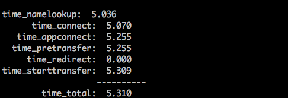

# 小程序server请求微信服务器超时


今天有同学在测试小程序的过程中，发现一个问题，调用 **微信官方的服务端接口超时** ，比如这个接口，`https://api.weixin.qq.com/sns/jscode2session` ，因为我们小程序登录的时候，会在自己server端调用微信的API，这个接口超时，导致我们的登录流程也就挂掉了。本来以为是偶尔的网络问题，但是，同学发现在测试服务器上，很稳定的复现超时！但是在我们本地测试过程中，请求微信服务器又很快响应。嗯，理论上微信服务器不会出问题的……

试着在服务器上去 `curl` 微信的接口，确实挺慢的，我们代码里配置了超时是3秒，目测确实超过了3秒才返回！抱着侥幸的想法，让同学把超时改成5秒，依然超时……嗯，略微有点尴尬。

试着 `ping api.weixin.qq.com` ，发现收到第一个包，隔着挺长时间，后面的包平均几十毫秒，网络应该也没问题吧。

没办法了，因为是服务端，只能用 `curl`，想看看这个工具能不能提供一下，整个请求的各个阶段，时间是怎么分布的。搜了一下，还真有这个功能，具体操作如下：

1. 在某个目录下，新建一个文件，比如 `curl-format.txt` ，内容如下：

```shell
 time_namelookup:  %{time_namelookup}\n
       time_connect:  %{time_connect}\n
    time_appconnect:  %{time_appconnect}\n
   time_pretransfer:  %{time_pretransfer}\n
      time_redirect:  %{time_redirect}\n
 time_starttransfer:  %{time_starttransfer}\n
                    ----------\n
         time_total:  %{time_total}\n
```

2. 在**同一个目录**下，执行 `curl` 操作：

```shell
curl -w "@curl-format.txt" -o /dev/null -s "https://api.weixin.qq.com/sns/jscode2session?xxx=xxx&xx=aa"
```

拿到的结果如下：



在网上查阅了下，各个字段含义如下(单位都是 **秒** )：


* time_namelookup: DNS 域名解析的时候，就是把 `https://zhihu.com` 转换成 ip 地址的过程
* time_connect: TCP 连接建立的时间，就是三次握手的时间
* time_appconnect: SSL/SSH 等上层协议建立连接的时间，比如 connect/handshake 的时间
* time_pretransfer: 从开始到最后一个请求事务的时间
* time_redirect: 从请求开始到响应开始传输的时间
* time_starttransfer: 从请求开始到第一个字节将要传输的时间
* time_total: 这次请求花费的全部时间


从上面截图中可以看出，我们服务器上，在DNS域名解析阶段，就花了 **5秒** ，难怪会超时了……

找到了问题，那就先在机器上修改 `/etc/hosts` 文件，写死一个微信域名的IP解析，**暂时** 把这个问题修复了。


## 相关资料


* [使用curl测试网络请求耗时](https://stackoverflow.com/a/22625150)
* [使用 curl 命令分析请求的耗时情况](https://cizixs.com/2017/04/11/use-curl-to-analyze-request/)


​     ——时2019年5月20日 周一 20:54 竣工于帝都五道口清华科技园