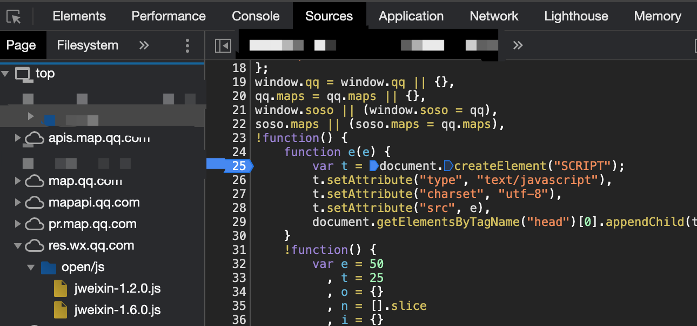
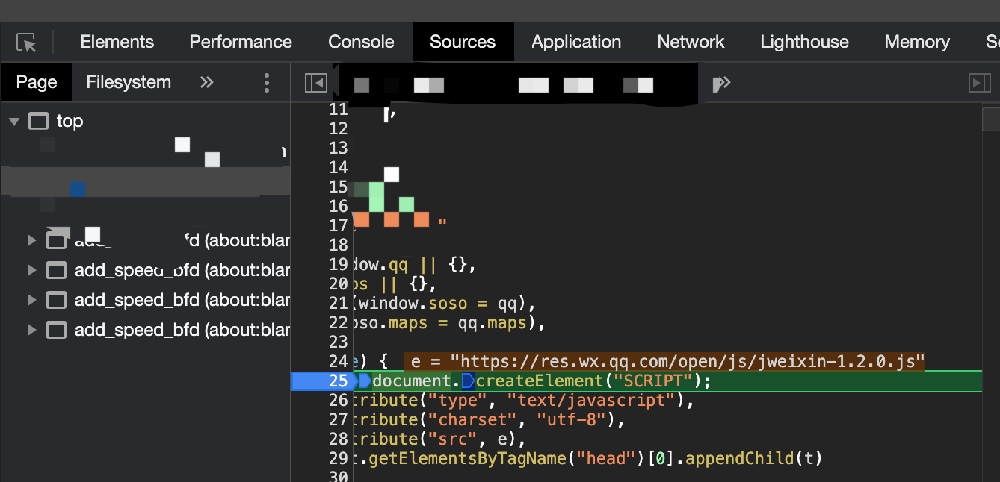
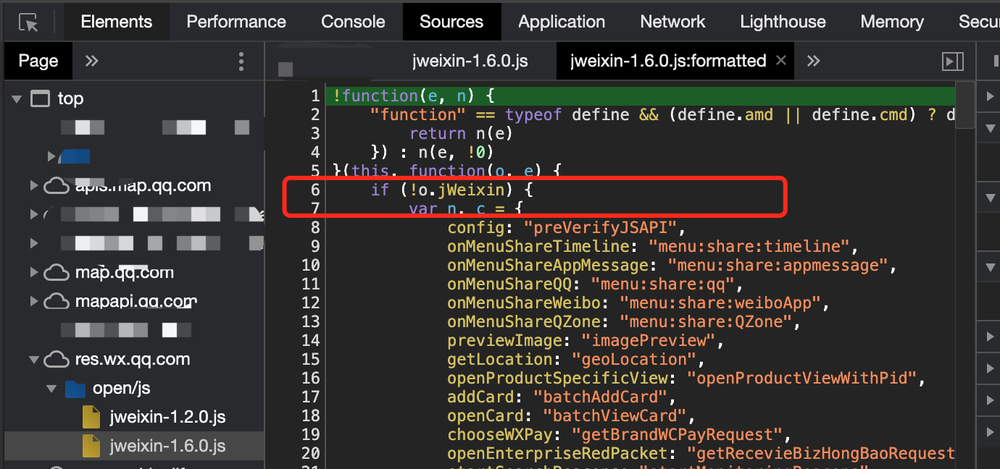

# wx.miniProgram undefined?


关键字：**微信小程序** 、`web-view` 、`腾讯地图API` 、`wx.miniProgram undefined` 。


## 背景

在微信小程序里，我们除了tab页等是原生页面，其他都是使用 `webview` 渲染的H5页面。在微信小程序里，部分H5需要设置用户分享出去的卡片title和图片，因此，我们会在H5里通过调用 `wx.miniProgram.postMessage` 把分享数据 **异步** 发送给小程序端，在小程序端的 `onShareAppMessage` 将收到的分享数据返回给微信端。

本周在发版时，QA发现小程序里，一个H5页面的自定义分享功能，很大概率设置失败，分享出去的卡片仍然是微信小程序自己截图，复现几率很大，几乎达到70%，但是偶尔又没问题……

尴尬的是，我们本次发版内容，并没有对这个H5页面做任何修改，而且小程序端的 `webview` 容器也没有任何改动！

在H5页面里加上 `console.log` 之后，发现失败的时候，异常提示 `wx.miniProgram  ` 是 `undefined` 。再去看代码，明明在 `index.html` 里通过  `script` 标签引入了 JS-SDK，版本是 1.6.0 。


## 猜测

### 猜测一

难道一直都有问题，只是之前测试没发现？仔细分析H5页面代码，发现在 `mounted` 生命周期里会调用 `postMessage` 方法，在这里报错了。难道是调用太早了，这时候微信SDK还没加载？下面2个现象否决了这个猜想：

1. JS报错内容是 `miniProgram` 是 `undefined`，如果SDK未加载或者加载失败，应该是 `wx` 对象为 `undefined` 才对
2. 这个H5页面里还有一个提示用户分享的按钮，当用户点击按钮的时候，还会再次调用 `postMessage` 方法去设置自定义分享，按理说无论如何，到用户点击的时候，微信SDK应该是加载完了

### 猜测二（甩锅）

难道是微信官方又整出bug了，毕竟众所周知，微信小程序bug太多，而且总是不改。

经过QA大佬们的测试，发现几乎全部的H5页面分享都有类似问题，都是偶发性的，不管iOS还是Android，不管是在H5进H5，还是从小程序原生页面进H5。

甚至跑去看了下微信[SDK代码](https://res.wx.qq.com/open/js/jweixin-1.6.0.js)，明明有 `miniProgram` 这个属性的啊，而且 `postMessage` 也在里面。


## 柳暗花明

想来想去，确实没有任何思路，偶发（大概率），不区分设备类型，不是JS加载问题。怎么办？好吧，那只有祭出debug调试大法了。在 **微信开发者工具** 里打开H5，准备去看看微信SDK代码，加断电看看，究竟怎么个情况。打开 `Sources` 页面，什么情况，为啥加载了两个SDK的JS，而且是不同版本的！！




感觉问题就出在这里了，我们HTML里只引入了 1.6.0 ，为什么会凭空多出 1.2.0 这个版本。

继续通过 `Network` 面板下的 `Initiator` ，发现 1.2.0的JS是被这个腾讯地图的JS **动态** 引入的：



腾讯地址的JS地址是 https://apis.map.qq.com/tools/geolocation/min?key=&referer= 。而我们在HTML里，JS的加载顺序是这样的：

```html
<script charset="utf-8" src="https://apis.map.qq.com/tools/geolocation/min?key=P&referer="></script>
<script src="//res.wx.qq.com/open/js/jweixin-1.6.0.js"></script>
```

我们1.6的SDK是 **同步** 引入的，而 1.2的SDK是上面的JS动态引入的，所有很大概率下，1.2的加载是在我们1.6的加载之后，所以覆盖掉了我们1.6的代码，从而导致找不到对象！

### 怎么办？

问题找到了，怎么办呢，大概想到了下面几种办法：

1. 修改腾讯地址的JS文件，删掉里面加载1.2版本SDK的代码，从根源解决这个问题，完美
2. 腾讯地图的JS是一个H5在使用，去掉全局加载，改成在用到的H5页面动态加载，这样至少能保证大部分H5功能正常

但是细想下来，两个方法都有点问题：方法1的问题是根本没法执行，因为JS是在腾讯服务器上，我们没法修改；方法2只是减小了影响面，问题仍然存在。


**能不能在发现要加载1.2版本的时候，不去加载对应的JS呢？** 

从上面的源码截图可以看出，动态加载是通过调用 `head` DOM的 `appendChild` 方法来实现的，如果我们能够 `monkey patch` 这个方法，然后判断下，当加载的是 `script` 并且 `src` 是微信1.2版本的SDK时，忽略掉这个调用。通过尝试，发现是可以的，代码如下：

```html
<script>
  !function(d){
    var h = d.getElementsByTagName('head')[0];
    var r = h.appendChild;
    h.appendChild = function(el){
      if (el.tagName === 'SCRIPT' && el.getAttribute('src') === 'https://res.wx.qq.com/open/js/jweixin-1.2.0.js') {
      } else {
        r.apply(h, arguments);
      }
    };
  }(document);
</script>
<script charset="utf-8" src="https://apis.map.qq.com/tools/geolocation/min?key=P&referer="></script>
<script src="//res.wx.qq.com/open/js/jweixin-1.6.0.js"></script>
```

在加载腾讯地图的JS之前，我们先替换掉原始的 `head.appendChild` 方法，加上内部判断处理。


OK，通过测试，发现1.2的JS不会加载了，自定义分享功能恢复。

但是，还得找用到腾讯地图的H5多测试下，是否能兼容微信 1.6版本的SDK，如果有问题，又该怎么办呢……（虽然**理论**上，按照JS的语义化版本，1.6的代码应该是能兼容1.2的，毕竟只是升级了 major.minor.patch 中的 minor，**但是**，到底是不是严格按照语义版本来升级的，就不得而知的😂）


莫不是，要把这两种方法结合起来，并且祈祷，在用到腾讯地图的H5，PM大大不会添加自定义分享的功能😂


​                                                    ---------时2023年2月10日 竣工于成都天府五街


## Update: 冤枉微信SDK了

在后来 `code review` 时，发现其他组内也同时使用了 微信SDK和腾讯地图SDK，但是始终没问题。

于是进一步 `debug`，发现微信SDK内，其实是有判断的，如果当前页面已经加载了SDK，就不会覆盖之前的SDK，代码截图如下：




因此，最终解决方案只需要把 1.6版本的SDK对应script，移动到腾讯地图SDK加载之前，就可以了，如下：

```html
<script src="//res.wx.qq.com/open/js/jweixin-1.6.0.js"></script>
<!--  腾讯地图  -->
<script charset="utf-8" src="https://apis.map.qq.com/tools/geolocation/min?key=&referer=="></script>
<script charset="utf-8" src="https://map.qq.com/api/js?v=2.exp&key="></script>
```


** 其实这也是最理想的方式，由SDK内部来判断，是否应该覆盖掉已有版本代码，因为SDK提供者才清楚知道各个版本SDK的差异，应该怎样覆盖或者合并最合适。 **

## 结论

这个故事告诉我们如下3个道理：
* 在引入第三方类库时，务必注意它的相关依赖，任何一个新的包引入，或者第三方包版本升级，都可能导致业务代码异常
* `JavaScript` 的加载顺序至关重要，不管是通过 `html` 文件里 `<script>` 同步引入，还是通过动态创建 `script` 标签动态加载，都要关注先后顺序
* `JavaScript` 的加载次序，尽量先加载 **最基础**的、**不依赖其他模块的** ，业务层代码（可以认为腾讯地图SDK也是业务层代码）靠后加载。在这个例子中，显然微信SDK要比腾讯地图SDK更底层，应当首先加载腾讯SDK


​                                                   