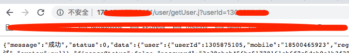
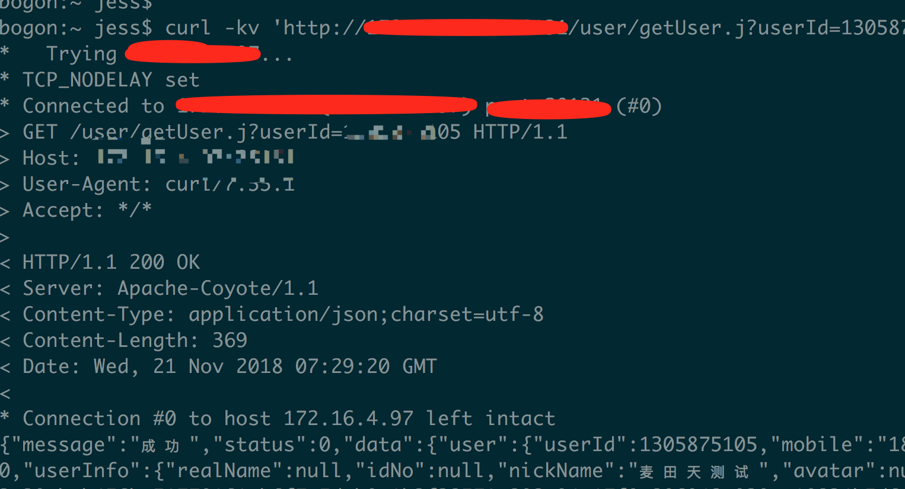
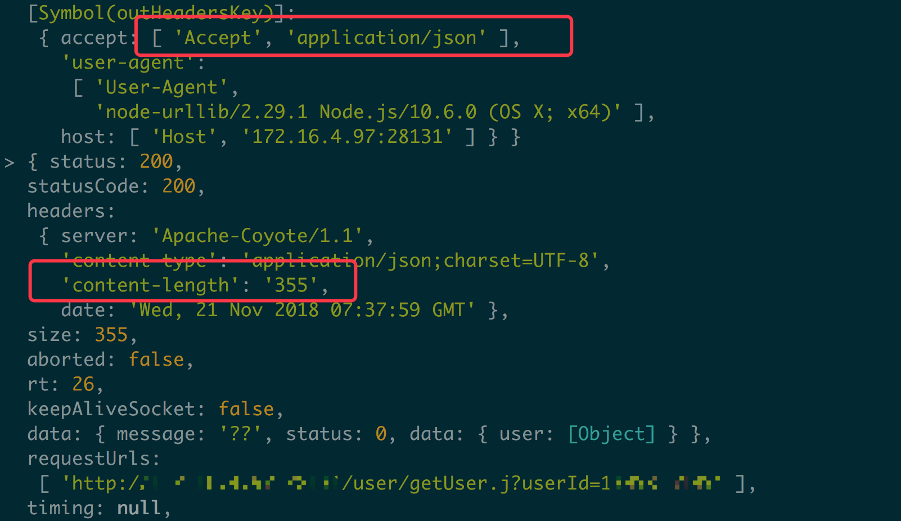
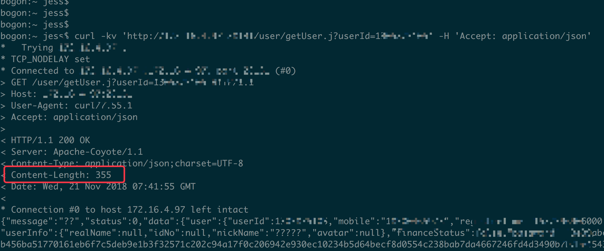

# node请求java中文乱码

好歹`nodejs`已经在线上跑了两三年了，一直没遇到中文乱码，昨天居然遇到了，到8102年了，还会出现中文乱码问题，为之奈何。
我们在 `node`层，使用的 [urllib](https://github.com/node-modules/urllib) 库，请求后端 `java` 接口，后端使用的是 `springMVC`框架。

后端有个接口，会返回一些中文字段，QA反馈node渲染页面里，中文乱码，都是问号。我想不应该吧，现在都是 **UTF-8** 编码了，怎么还会有中文乱码呢？拿到后端接口，直接在浏览器里访问，居然中文正常显示了，在命令行 `curl` 一样没问题，像下面这样：

 有点意思了。同时在node里请求，确实是乱码的。还就不行这个邪了，浏览器可以，node不行，还能不能好好玩了。开始对比后端返回的`http header`，发现在node请求的时候，后端返回的 `content-length: 355`，但是在 浏览器和curl里，都是 `content-length: 369` ，嗯，There must be something wrong!

 无意间看到，node中 **请求的header** 和浏览器里不太一样，只能死马当活马医了……node里，有一个 `Accept: application/json` 的请求头，于是拿这个header，加到 `curl` 里测试，果然啊，curl也乱码了：

 

 同时注意到，这里返回的 `content-length: 355` 也和node乱码的一样！看来，后端接口，针对不同的 请求`Accept` header，还可能返回不同的编码！

 后端框架是 `springMVC`，我也不太懂，大概Google了下，确实有一些相关文章，备注下：

 * [关于SpringMVC返回字符串(JSON)乱码问题](http://ju.outofmemory.cn/entry/242183)
 * [SpringMvc 遇到的坑,返回中文乱码](https://blog.csdn.net/u010979495/article/details/50610856)

定位到问题了，后端改起来，貌似挺复杂，最终在node层修改代码，将 `Accept: application/json` 改成 `Accept: application/json;charset=utf-8` 。

      ---- 时2018年11月21日 15:47 竣工于帝都五道口
