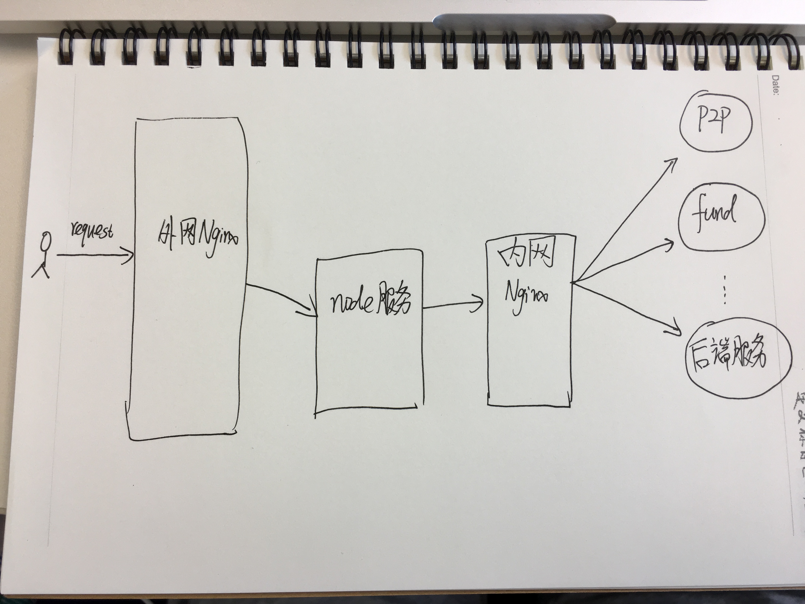

# `Node.js` 请求后端超时

"终于，世界安静了"

忘记在哪儿见过这句话，除了他，找不到更贴切的文字，来描述这个周日早晨7点的心情。

## 诡异的timeout

前后端分离(`Node.js` + `Java`)已经进行了一年多了，在大规模上页面之前，一直担心踩到什么搞不定的坑，
没想到这一年来竟非常顺利，完全没遇到什么奇怪的坑。真的是幸福来得太突然，那一定是假的。

应该是从今年4月的机房断电开始，线上`Node`机器时不时就报大量的请求后端超时，尤其是有重大活动，或者
被人刷接口的时候。最前端看，各个接口响应慢；看`Node`服务日志，一直报请求后端超时(timeout)，但是从
内网`Nginx`或者后端的`Java`服务看，流量很正常，或者说比平时还少……

## 流量去哪儿了

请求到达外网`Nginx`没问题，请求到达`Node`服务也到了，可请求到不了内网`Nginx`，在`Node`日志里只能看到
大量请求后端(经过内网`Nginx`)超时，但是内网`Nginx`根本没收到流量啊大哥，这超时是哪儿冒出来的……

OK，到了这里，是应该把我们服务拓扑图拎出来看看了：

根据这个结构，`Node`请求后端服务，都是经过 `内网Nginx`来转发的，现在`Node`报的超时日志，应该是请求
`内网Nginx`超时，怀疑是内网nginx机器扛不住了(其实根本不可能，这么点流量……)。但是看内网nginx日志，并没有
错误日志。又怀疑是不是在操作系统层面，tcp连接数用完了，看了内网nginx机器的连接数，也比较低的，根据网上
说的一些配置tcp连接的系统参数，都配置的没什么问题。这真是要开始怀疑人生了啊！！
