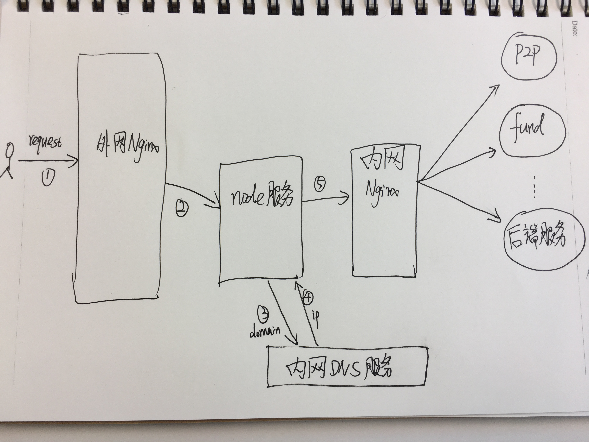

# `Node.js` 请求后端超时

"终于，世界安静了"

忘记在哪儿见过这句话，除了他，找不到更贴切的文字，来描述这个周日早晨7点的心情。


## 诡异的timeout

前后端分离(`Node.js` + `Java`)已经进行了一年多了，在大规模上页面之前，一直担心踩到什么搞不定的坑，
没想到这一年来竟非常顺利，完全没遇到什么奇怪的坑。真的是幸福来得太突然，那一定是假的。

应该是从今年4月的机房断电开始，线上`Node`机器时不时就报大量的请求后端超时，尤其是有重大活动，或者
被人刷接口的时候。最前端看，各个接口响应慢；看`Node`服务日志，一直报请求后端超时(timeout)，但是从
内网`Nginx`或者后端的`Java`服务看，流量很正常，或者说比平时还少……

## 流量去哪儿了

请求到达外网`Nginx`没问题，请求到达`Node`服务也到了，可请求到不了内网`Nginx`，在`Node`日志里只能看到
大量请求后端(经过内网`Nginx`)超时，但是内网`Nginx`根本没收到流量啊大哥，这超时是哪儿冒出来的……

OK，到了这里，是应该把我们服务拓扑图拎出来看看了：


根据这个结构，`Node`请求后端服务，都是经过 `内网Nginx`来转发的，现在`Node`报的超时日志，应该是请求
`内网Nginx`超时，怀疑是内网nginx机器扛不住了(其实根本不可能，这么点流量……)。但是看内网nginx日志，并没有
错误日志。又怀疑是不是在操作系统层面，tcp连接数用完了，看了内网nginx机器的连接数，也比较低的，根据网上
说的一些配置tcp连接的系统参数，都配置的没什么问题。这真是要开始怀疑人生了啊！！

## 方向错了~

实在找不到原因啊，上面领导貌似也没有准备细查的想法，那只能先这样了……

问题不解决，睡觉也不安稳啊，不知道哪天起来，线上服务就全线挂了……

现实也确实这样，有些事情，不经历不知道，还真就有些无聊的人，时不时跑来刷一些我们接口，嗯，结果正如我们知道
的，线上又报警，大量超时。

这期间有一次异常的时候，和OP追线上log，发现有一些是DNS解析异常的。这就不能理解了，我们node机器上，应该是
把后端服务的域名和IP，绑定在机器的 `hosts` 上的，这也会DNS解析异常么？OP大神果断指出了我的错误：node机器
上，**并没有** 绑定hosts，而是通过一台内部的DNS服务器，来解析后端域名！！

我**，去年上线的时候，明明是绑定的hosts，啥时候给改成了走内部DNS服务器，也不告知一下的，还能这么玩啊！！

然而，问题还是没解决，OP去看了DNS服务，很少的错误日志……

锅还在头上扣着，肿么办:(

好歹重新认识了我们的后端结构，应该是这样的：



虽然还是没能定位到问题，好歹终于知道了后端真是的架构图了，thank god!!

## 柳暗花明

在经历了每周线上总会异常那么一两次之后，高层总算下定决心，投入人力时间来定位下这个了。

星期天凌晨4:00 ~ 7:00 ，直接在线上压测，现场定位问题。

要不怎么说，上帝关上门的时候，还是会偷偷的给你留个狗洞呢。这周再一次超时的时候，二货(同学&小组leader)坚持
让OP看了下那台DNS服务器的错误日志，在服务的错误日志里，没什么发现；但是在系统日志里，有大量的如下日志，正好
对应我们node的超时时间：

```
kernel: nf_conntrack: table full, dropping packet.
```

看字面意思，丢包，并且这个系统错误日志的时间，和node超时的时间也基本一致，嗯，看到了一丝丝胜利曙光了。

OP同学和我们都查了下这个日志，[这篇文章](https://testerhome.com/topics/7509)描述的现象，和我们基本一样的，
请求超时！

为了简单处理，在周日凌晨压测的时候，先复现了node超时日志；然后 **关闭DNS服务器的防火墙**，再压，node还是大量报
超时！！果断看下内网nginx是不是也开了防火墙，果然，**关闭内网nginx防火墙**，再压，流量顺利到达内网nginx！！！

诺曼底登陆，终于成功了！！！


## 故事就这样结束了？

然后，并没有！！就在刚才(20170620)，线上流量异常，内网nginx连后端又 `connect upstream timeout`, `reset by peer`
了……赶紧研究日志了。。。。


时20170620周二11:37竣工于帝都五道口清华科技园~
