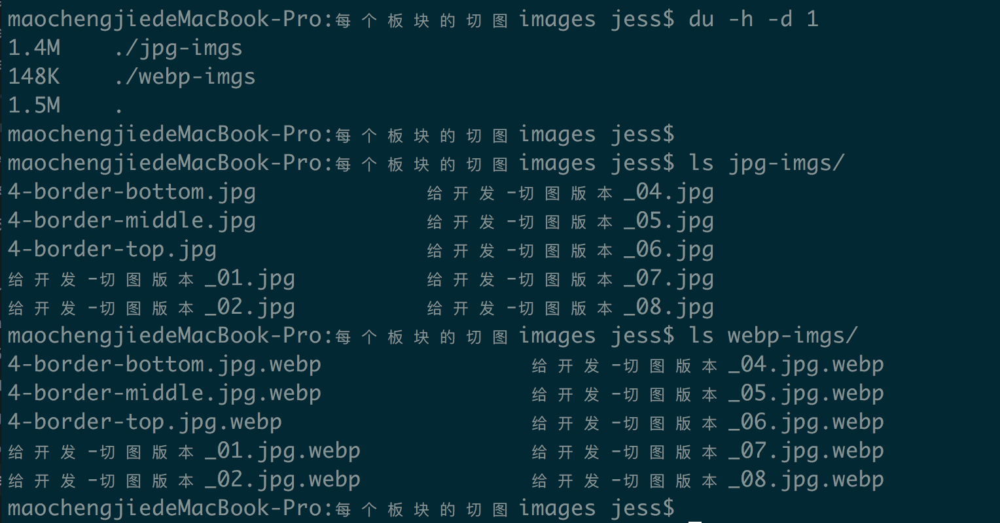
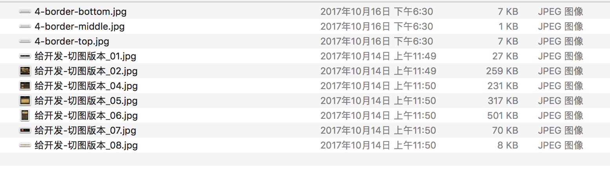
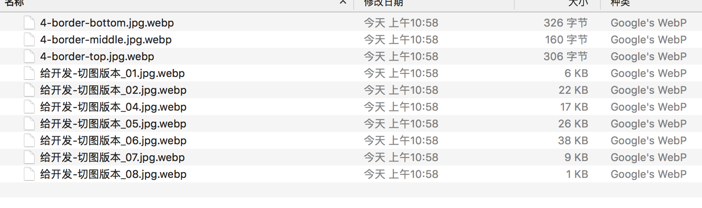
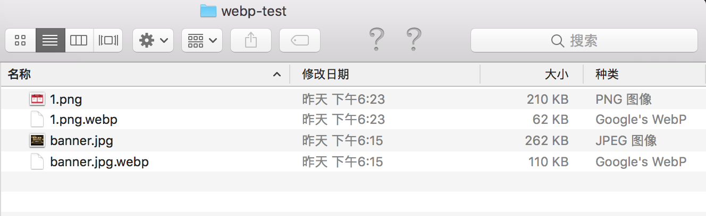

# webp图片实战


##　上webp难于上晴天

之前关于`webp图片`上线，调研了一个通过 `服务端内容协商(server content negotiation)` 的技术
实现方案，具体见 [nginx webp 响应式](https://github.com/sophister/2bugua5/blob/master/experience/nginx-webp-auto-responsive/nginx-webp-responsive.md) 。但是这个方案，上线起来成本比较大，需要推动OP，升级`nginx`，安装`lua`脚本的相关依赖，
并且可能需要单独的`图片服务器`来专门负责处理图片，短期内想上线，几乎没希望……


## 没条件上，就创造条件

但是，`webp`不能成功在我司上线，是完全不能忍的。因此，就有了本次的小成本上线方案。

可能有同学会疑惑，为什么非得上`webp`？无他，为用户省流量，为公司省成本，为页面提速度。既然都提到
了`H5页面提速`这个话题，不妨说下接下来的想法，主要从这两个方面来提速，也可以说是分两步走吧：

1. 对各种图片资源，png/jpg 等，`webp`化
2. JS/CSS 文件，`localstorage`化，就是把JS、CSS都存储在浏览器`localstorage`里

本篇文章，说的就是第一步，图片`webp化`。

`webp`的介绍和实战文章，网上已经很多了，优点就是缩小图片文件大小，缩短图片下载时间，最终缩短页面
渲染时间，提升用户体验。看了些晚上图片，大多数都说针对 jpg/png 图片转换成 `webp` 后，文件大小大概
降低 `20% - 30%`。下面是我把本周上线的一个活动页面图片，都是经过UE压缩过的 `jpg图片`，
拿来通过 `cwebp`工具转换后，对比的结果：







PS，顺便记录下，mac下批量文件处理的`shell`：

```shell
find . -name "*.jpg"  -exec cwebp {} -o {}.webp \;
```

可以看出，随便一个活动页面，图片从jpg转换成`webp`之后，整体大小几乎只有`jpg`的 **1/10** ！当然，这应该
和我们设计给的图片本身的压缩有关，但至少从我们公司来看，图片还是很有优化的必要的。

下面是我通过 [node-sharp](https://github.com/lovell/sharp) 这个`node包`，对另外一个活动
的两个图片，随机转换成`webp`的结果：



可以看出，`jpg`到`webp`，文件大小缩小 **50%** ；`png`到`webp`，文件大小缩小 **70%** 。

再次说明：**上述结果，只是我本次使用图片压缩出来的结果，并不是说webp能压缩这么多！！** 。


## webp上线方案

下面是根据我司情况，出的一个上线方案。

在我司，通常PM、UE、运营上传图片，都是通过一个内部的`CMS系统`，这个CMS是由我们前端开发&维护，其实
大部分已经开源出来了，就是 [这个东东](https://github.com/WE-FE-TEAM/grape-cms) ，但是后来的
大量更新，代码是在内网了……  因此，我们可以在 `CMS` 上开始来搞事情。

总的方案其实很简单：

1. CMS系统针对用户上传的 **jpg/png** 图片，自动转一份 `webp`格式，比如原图是 a.jpg，那么自动保存一份
 a.jpg.webp
2. 开发通用的 `img` 组件（包括`React` `Vue.js`版本），用来替换`HTML`原生的 ``标签。
在自定义`img组件`里，通过JS检测当前浏览器是否支持`webp`，如果支持，则自动给 `src` 属性增加 `.webp`
后缀，优先请求`webp`图片；图片加载失败，替换`src`属性为原图

第1步内部上线CMS修改即可。准备使用 [`node-sharp`](https://github.com/lovell/sharp) 这个库来
对图片进行格式转换，这里有个坑，我本来使用的 node-5.3.0 居然安装始终报这个错误：

```shell
const EOF = Buffer.alloc(1024)
                   ^

TypeError: Buffer.alloc is not a function
```

最后索性把 node 升级到最新的 `8.7.0` ，解决了这个问题。


第2步，通过JS来检测当前浏览器是否支持 `webp`，原理就是 通过原生`Image`对象，加载一个很小的 `webp`
图片`base64`，比如 2 * 2 px 大小，如果加载成功并且获取到图片的高度等于2px，那么当前浏览器支持`webp`；
否则不支持。

上述第2步，看似成本很大，其实还好。因为我们目前很多 `LP页面`，都是通过内部的 `page builder`系统
拖拽生成的，使用的图片都是同一个包里的组件，因此只要修改一处，即可解决大量`LP`页面的问题，并且，
这些`LP`往往都是大量的图片堆砌出来的，更能体现价值。


OK，等上述 `webp`图片上线后，再处理 `JS/CSS localstorage化` 的问题吧。


          时2017年10月19日周四 14：37 竣工于帝都五道口清华科技园
