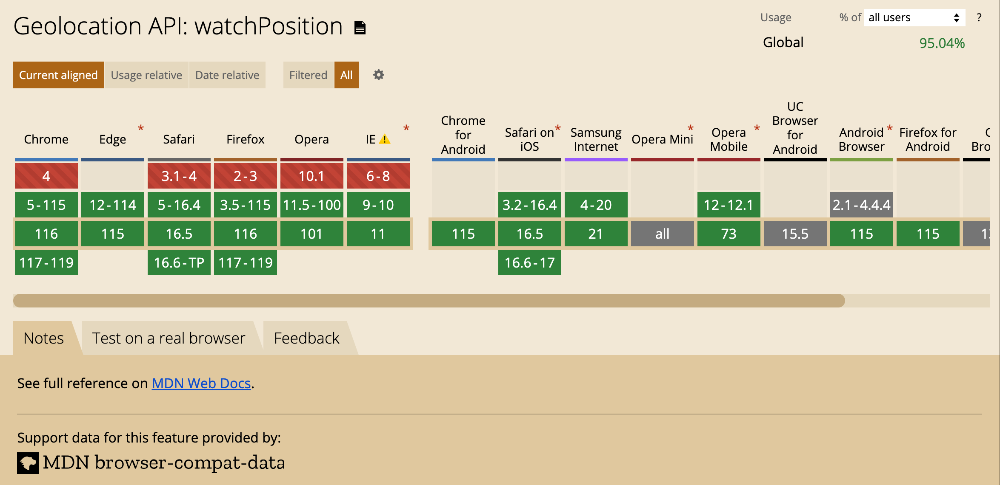
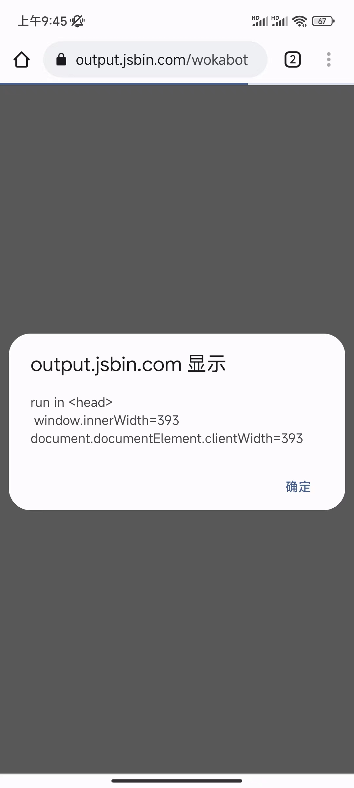
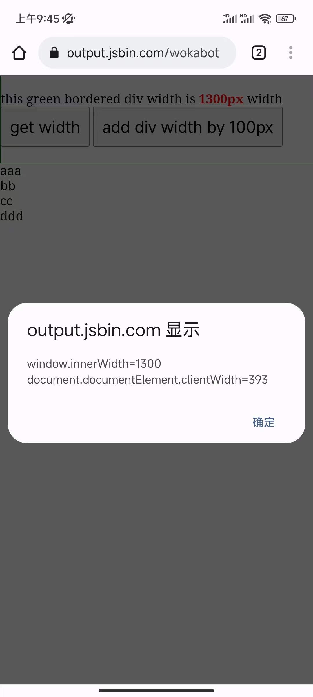
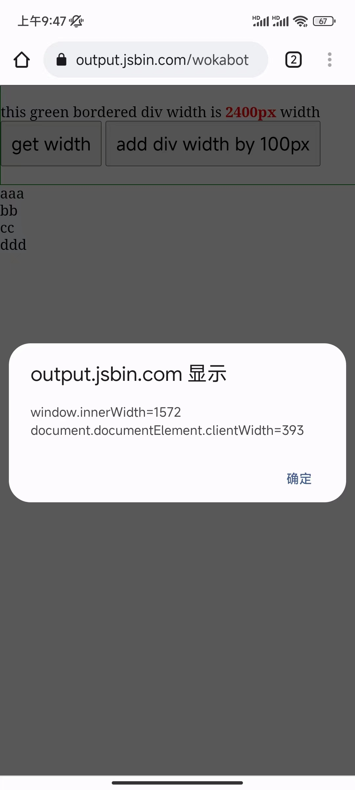

# [日积跬步]系列之2023年


## 20230818 web监听设备实时定位变化


有一个需求，需要在web页面里 **实时监听用户定位** ，发现 微信小程序原生是有对应API的，[wx.onLocationChange](https://developers.weixin.qq.com/miniprogram/dev/api/location/wx.onLocationChange.html) ，但我们场景里是一个 H5 页面，于是去微信公众号网页开发里看了下，并没有找到类似的监听实时地理位置变化的API，为什么H5里会没有呢……

原来，浏览器原生已经提供了这个API了 [navigator.geolocation.watchPosition](https://developer.mozilla.org/en-US/docs/Web/API/Geolocation/watchPosition) ，能够实时获取到H5设备的定位变化。

使用也很简单，让GPT写了个demo，实时监听用户定位并且把信息追加到页面上，代码如下：

```html
<!DOCTYPE html>
<html>
<head>
  <title>Real-time Position</title>
</head>
<body>
  <textarea id="position"></textarea>

  <script>
    const positionTextArea = document.getElementById("position");

    function success(pos) {
      const crd = pos.coords;
      const latitude = crd.latitude;
      const longitude = crd.longitude;

      positionTextArea.value += `Latitude: ${latitude} °, Longitude: ${longitude} °\n`;
    }

    function error(err) {
      positionTextArea.value += `Error: ${err.message}\n`;
    }

    const options = {
      enableHighAccuracy: true,
      timeout: 5000,
      maximumAge: 0,
    };

    navigator.geolocation.watchPosition(success, error, options);
  </script>
</body>
</html>
```


在线demo链接：[https://output.jsbin.com/vipumas](https://output.jsbin.com/vipumas)

在微信浏览器环境使用上述demo页面，Android(小米13)和iOS(系统16.2，感谢王大神和强哥的爱疯手机)，都能够正常收到成功的回调函数。

看了下兼容性，还是不错的，https://caniuse.com/?search=watchPosition ，




## 20230807 https页面请求http://localhost


最近遇到一个场景，浏览器里web页面需要和 `http://localhost:8000` 电脑本地服务进行数据交互，最开始浏览器里页面也是 `http://` 协议的，请求本地的 `http://` 服务配置上允许跨域之后，没问题。

后来为了安全（用的[自签名证书](https://learn.microsoft.com/zh-cn/azure/application-gateway/self-signed-certificates)），浏览器里需要升级成 `https://` 协议，在评估的时候，我想电脑本地的服务也需要升级成 `https://` 协议的，比如这样`https://localhost:8000,` ，如果不升级的话，应该会被浏览器判定为 [Mixed Content](https://developer.mozilla.org/en-US/docs/Web/Security/Mixed_content) ，应该会被**blocked** 掉。

在浏览器里页面升级到 `https://` 之后，实际访问页面时，发现浏览器（Chrome）并没有报 `insecure content was loaded over HTTPS, but requested an insecure resource`，能够正常通过 `ajax` 请求本地的 `http://localhost:8000` 服务获取数据……但是，我页面里请求其他域名下的 `http://` 接口，就被浏览器block了，报了上面这个错误（符合预期）。大概就是下面这样：

* 假设浏览器里页面链接 `https://test.ecool.fun/a.html` 
* 通过 `ajax`访问用户电脑本地服务 `http://localhost:8000` ，可以正常访问，没有任何报错（为什么没有被阻止掉？）
* 通过 `ajax` 访问其他在线服务 `http://some.other.com/api` ，被浏览器block掉，不允许发起请求（符合预期）


### 结论

规范认为，`127.0.0.1` 或者 `localhost` 是可信的域，允许 `https://` 页面请求 `http://127.0.0.1:8000` 或者 `http://localhost:8000` 的服务（**端口只是个例子，随便换个其他端口都可以**）


参考资料：

* [Is origin potentially trustworthy?](https://w3c.github.io/webappsec-secure-contexts/#is-origin-trustworthy)
* [Mixed-content request from HTTPS page to HTTP (non-HTTPS) localhost address not blocked](https://stackoverflow.com/questions/60448948/mixed-content-request-from-https-page-to-http-non-https-localhost-address-not)


## 20230308 window.innerWidth不可靠


最近在一个*SSR*项目里，遇到一个奇怪的问题，`window.innerWidth` 并不是真实的浏览器可视区域宽度，而是会受 **DOM结构里子元素width** 的影响（BTW，在桌面Chrome里没问题，但是在移动端Chrome里有问题）。


于是写了下面这个demo，来验证 `window.innerWidth`是否真的不可靠。

```html
<!DOCTYPE html>
<html>
<head>
  <meta charset="utf-8">
  <meta name="viewport" content="width=device-width, initial-scale=1">
  <title>window.innerWidth affected by dom's width</title>
  <script>
    !function(){
      var msg = 'run in <head>\n window.innerWidth=' + window.innerWidth;
      msg += '\ndocument.documentElement.clientWidth=' + document.documentElement.clientWidth;
      alert(msg);
    }();
  </script>
</head>
<body>

  <div style="width: 1000px;" class="con">
    <div>this green bordered div width is <span class="width-con">1000px</span> width</div>
    <button id="btn">get width</button>
    <button id="plus">add div width by 100px</button>
  </div>
  <div>aaa</div>
  <div>bb</div>
  <div>cc</div>
  <div>ddd</div>
</body>
</html>
```

忽略了CSS代码，下面是JS代码。很简单，初始状态，我们会给 `.con` 一个宽度是 `1000px`，然后可以获取 `window.innerWidth` 和 `document.documentElement.clientWidth` ，之后再增加 `.con` 的宽度，再次获取：

```javascript
var btn = document.getElementById('btn');

btn.addEventListener('click', function(){
  var msg = 'window.innerWidth=' + window.innerWidth;
  msg += '\ndocument.documentElement.clientWidth=' + document.documentElement.clientWidth;
  alert(msg);
}, false);


var initWidth = 1000;
var con = document.querySelector('.con');
var plusBtn = document.getElementById('plus');
var widthCon = document.querySelector('.con .width-con');

plusBtn.addEventListener('click', function(){
  initWidth += 100;
  con.style.width = initWidth + 'px';
  widthCon.innerHTML = con.style.width;
}, false);
```

上面代码，在PC端Chrome执行是没有问题的。下面是在移动端Chrome的执行截图：

1. **在 `<head>` 里运行结果** 

   

2. **`div width=1000px` 读取结果**

   

3. **`div width=1300px` 读取结果**

   

4. **`width=2400px` 读取结果**

   


你也可以通过这个demo链接访问试试：[https://output.jsbin.com/wokabot](https://output.jsbin.com/wokabot) 


说明：

* 上述截图是在 Android的Chrome里截图，在我手机上，微信里截图也这样。显然，`window.innerWidth` 的值收到了页面内部元素 `width` 的影响，但是看上去 `window.innerWidth` 有个最大值，内部元素 `width` 超过一定宽度，`window.innerWidth` 不会继续增大。
* 找了其他大佬的iOS里，`window.innerWidth` 值没有问题，和PC端一样，正确的
* PC端的Chrome里是 **正确** 的，没问题


想起之前移动端H5适配方案（基于 `rem` 方案），会用到浏览器宽度来计算 `<html>` 的 `font-size`， 赶紧看看阿里官方代码（[https://github.com/amfe/lib-flexible/blob/2.0/index.js#L18](https://github.com/amfe/lib-flexible/blob/2.0/index.js#L18)），还真是没有用 `window.innerWidth`，而是用的 `document.documentElement.clientWidth` ，有可能也是遇到过类似问题？


一句话结论：**在获取浏览器可视区域宽度的地方，应该使用 `document.documentElement.clientWidth` ，不要使用 `window.innerWidth` ** 。

