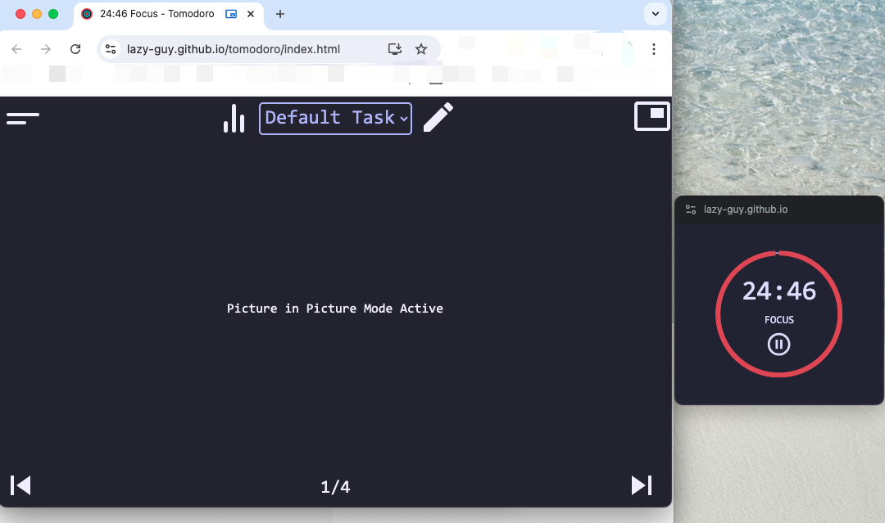

#  [日积跬步]系列之2024年


## 20240731浏览器画中画API(document-picture-in-picture)

今天在看一个微信文档的时候，看到视频下方的按钮中，有一个奇怪的icon，hover上去显示的是 *PiP mode* ，感觉很深不可测的样子。点击之后，视频出现在单独的一个小窗口中，并且悬浮在其他窗口上方，这就是传说中的 **画中画** 么。

这个API名称也很直接，就叫 **Document Picture-in-Picture API** 。API文档可以参考下面的官方文档，用法还是比较简单：

```javascript
async function enterPiPMode() {
    if (! ('documentPictureInPicture' in window) ) {
      // 检测当前浏览器是否支持 普通元素 的画中画
      alert('Picture-in-Picture is not supported in your browser.');
      return;
    }
    const pipOptions = {
      // 下面两个配置，在官方文档没找到
			initialAspectRatio: 5 / 4,
			lockAspectRatio: true,
      
			disallowReturnToOpener: true,
		};

		pipWindow = await documentPictureInPicture.requestWindow(pipOptions);
      // 赋值主页面的样式到独立的画中画window中
		[...document.styleSheets].forEach((styleSheet) => {
			try {
				const cssRules = [...styleSheet.cssRules].map((rule) => rule.cssText).join("");
				const style = document.createElement("style");

				style.textContent = cssRules;
				pipWindow.document.head.appendChild(style);
			} catch (e) {
				const link = document.createElement("link");

				link.rel = "stylesheet";
				link.type = styleSheet.type;
				link.media = styleSheet.media;
				link.href = styleSheet.href;
				pipWindow.document.head.appendChild(link);
			}
		});
    // 把目标元素挂载到画中画的body上
    pipWindow.document.body.append(con);
    // 这里其实可以用画中画的body上挂载更多的html元素，比如添加一些自己的按钮之类的
  }
```


**注意**，由于我们之前是把源DOM挂载到了画中画窗口，在退出画中画模式的时候，需要找到源DOM的父节点，重新把源DOM挂载回本来的位置上。

**另外**，进过我的demo测试，画中画的 `pipWindow` 不能重复使用，每次进入都需要新生成一个，不知道是不是使用姿势不太对，而且官方文档也提到了上面把 `CSS` 样式从源文档复制到画中画也是一次性的。


写了个简单的demo，演示把一个 `div` 元素在画中画和源文档中进行切换：https://output.jsbin.com/xayejew


Google文档上放了这个demo(https://lazy-guy.github.io/tomodoro/index.html)，还比较好看，[源码](https://github.com/lazy-guy/tomodoro/blob/main/index.js#L1579)也可以参考下，截图吐下：




### 使用场景

这个API最初就是从 `video` 标签的画中画API进化来的，所以最大的应用场景还是视频的画中画功能吧，类似B站或者油管之类的。

在一些有复杂表单的web页面，可能数据会分在多个页面里或者多个子步骤中，我想在这种场景，也有一定用处，可以让用户不用来回切换tab页，把当前页面所需要的一些 *上下文* 信息用画中画形式悬浮在桌面上，能带来使用上的一些便捷。


### 使用限制

画中画窗口类似于通过 Window.open() 打开的 **同源** 空白窗口，但有一些区别：

- 画中画窗口浮在其他窗口之上。
- 画中画窗口不会超过打开窗口的生命周期，主页面关闭（或者reload），画中画窗口都会关闭。
- 画中画窗口不能进行导航。
- 网站无法设置画中画窗口位置。
- 每个浏览器选项卡最多只能有一个画中画窗口，用户代理可能进一步限制全局打开的画中画窗口数量。我测试的结果是，**Chrome只允许一个画中画窗口，这是全部标签页共享的** ，当在第二个标签页打开画中画时，如果之前已经有打开画中画，那之前的画中画会关闭。


### 参考文档

* https://developer.chrome.com/blog/watch-video-using-picture-in-picture
* https://developer.chrome.com/docs/web-platform/document-picture-in-picture
* https://developer.mozilla.org/en-US/docs/Web/API/Document_Picture-in-Picture_API


## 2024-07-24 JS文件上传，中文文件名乱码


最近遇到一个问题，用 `antd`做了个文件上传功能，服务端是 `express.js` ，使用了 `multer` 来实现node里的文件上传功能。功能都正常，直到后端大佬说收到的文件名是乱码的，因为他传了一个 **文件名里带中文的文件** 。

之前也用node搞过文件上传，所以我直觉上想是不是后端上传文件的姿势不对，下次趴着试试🙄……随便找个中文的文件名来上传，确实看到服务端文件名乱码了，甚至趴着上传也不行🤣

THRER MUST BE SOMETHING WRONG

作为专业的面向Google工程师，果断开始找Google要答案。

原来这算是 `multer` 这个类库里的一个bug，它本身使用了另外一个类库 `busboy` 来解析 `multipart/form-data` 的请求数据，这个类库本身是支持解析 **utf-8** 的文件名的，只是 `multer` 在使用时并没有加上对应参数，可以参考这个 `PR`: https://github.com/expressjs/multer/pull/1210 。但不知道是不是 `multer` 作者去度蜜月了，这个PR已经超过1年了，还是**没有**合并……

问题没修复，打工人还得搬砖，还好在这个issue下面（https://github.com/expressjs/multer/issues/962），好心人给出了临时的解决方案：

```javascript
// 这里假设上传了多个文件
req.files[0].originalname = Buffer.from(req.files[0].originalname, 'latin1').toString('utf-8');
```


**总结一句**，上面这个文件名乱码的原因，就是请求时给后端的是 `utf-8` 编码的文件名，但是后端（在这里是 `nodejs`）在解析文件名时，是以 `ISO-8859-1` 编码来解析的，所以出现了乱码。


在这个 RFC6266 的文档里，（https://datatracker.ietf.org/doc/html/rfc6266#section-5），还给出了一种新的带编码说明的请求格式，然而 JavaScript 里不能手动设置，在其他场景倒是可以试试：

```
Content-Disposition: attachment;
                          filename="EURO rates";
                          filename*=utf-8''%e2%82%ac%20rates
```


写了个demo，可以用来复现 `express.js` 配合 `multer` 的文件上传，中文名乱码问题，在这个仓库：https://github.com/sophister/multipart-utf8-filename-demo


## 2024-06-26 iOS上H5不能用input上传文件，前端改一下吧


今天突然测试和APP大佬找过来，说我们的H5在iOS系统上（没错，我们是`hybrid`架构），在文件上传的地方会导致APP闪退（`crash`）。真是，人在工位坐，锅从天上来啊。

找到对应H5看了下，页面很简单，使用 `input[type=file]`来让用户选择手机照片或者用相机拍照后上传，没有复杂的功能。我们系统除了在APP，还有微信小程序，所以问了下测试同学，在微信小程序里的H5，图片上传是不是正常的，回答是正常的，而且点击之后，弹出来的那3个系统菜单都和我们APP里一样。H5代码如下：

```html
<input type="file" accept="image/png, image/jpeg" @change="onFileChange">
```

因为是在测试一个H5新需求的时候，无意中发现了这个上线很久的功能异常，而且APP大佬还提到一点，即使系统给APP授权了相机拍照权限，在H5里拍照的时候还是会崩。

“这个看来是H5兼容性有问题，不能使用input原生标签，H5页面改成调用APP的桥方法吧”，APP大佬说。

“好的，我看看怎么改下，在iOS里做下兼容，不用原生标签，改成调用APP的桥方法来上传”，负责新需求的前端大佬效率很高，撸起袖子就是干。

虽然被周围大佬们高效的决策和执行力所折服，我还是**总感觉哪里不太对劲**，以前倒是听说过`webview`里使用原生 `input` 标签上传文件存在兼容问题，但印象里都是很多年前了，而且从目前的情况来看，同一个H5页面，在我们APP里不行，在微信小程序的 `WKWebView` 里却可以，有没有可能是我们APP哪儿有幺蛾子呢？

要不，咱写个demo来试试，还是让代码来说话？幸好我这9年的mac还没退休，为了让xcode跑起来，先删出来50GB的系统存储空间，然后再把几年没升级的OSX系统升级到12.7.5。找**ChatGPT**写了个简单的demo：

```swift
import UIKit
import WebKit

class WebViewController: UIViewController, WKUIDelegate, WKNavigationDelegate {
    
    var webView: WKWebView!
    var completionHandler: (([URL]?) -> Void)?
    
    override func loadView() {
        let webConfiguration = WKWebViewConfiguration()
        // Enable JavaScript
        webConfiguration.preferences.javaScriptEnabled = true
        
        // Enable localStorage
        webConfiguration.preferences.setValue(true, forKey: "allowFileAccessFromFileURLs")
        webView = WKWebView(frame: .zero, configuration: webConfiguration)
        webView.uiDelegate = self
        webView.navigationDelegate = self
        view = webView
    }
    
    override func viewDidLoad() {
        super.viewDidLoad()
        
        if let filePath = Bundle.main.path(forResource: "index", ofType: "html") {
            let fileURL = URL(fileURLWithPath: filePath)
            webView.loadFileURL(fileURL, allowingReadAccessTo: fileURL)
        }    

    }
}
```

HTML代码如下：

```html
<input type="file" accept="image/png, image/jpeg" />
```


拿出尘封了8年的iPhone7，充上电，还能跑😲。


从真机运行结果来看，**不管是从相册选取照片、还是拍照（包括前后镜头），`WKWebView` 都是支持的**，至少在我测试的这个iOS系统版本（**15.7.1**）上工作良好，并没有崩溃的问题，原生标签在选择图片之后，还贴心的把一个预览小图放在了 `input` 的右侧🤣


作为一名码农，经常会被人要求执行力，仿佛不管啥需求扔过来，我们要第一时间按照别人指示开干，执行力就强，输出爆表。接触过一些同学，确实执行力很强，需求还没讲完可能都写了几十行代码了。私以为，肯实干是好事，但也不能少了 **质疑&调研** 的能力，特别是一些大家可能都不是太懂的场景，更需要我们有质疑的能力，为什么要这样做，是否合理。

身为一名页面仔，在 `hybrid APP`架构中，经常听到“这个东西原生做要发版，H5做一下兼容吧”、“两端实现有点区别，H5里兼容下吧，成本不大”等等，怎么说呢，倒不是不能帮忙擦屁股，但擦屁股频率太高了，会不会把腚给擦坏了啊，毕竟H5可不知道原生适合的力度啊😂


## 2024-05-22 Web音频录制wav&采样率调整


最近在做一个客服聊天的H5，需要实现在H5页面里用户可以录音识别来提问，通常都是使用 `MediaStream` `AudioContext` 来实现，但是有个问题，我们后端的识别接口只能是 `wav`格式的音频文件并且**采样率**是16000或者8000，Chrome默认的输出音频格式为 `audio/webm` 格式，支持默认调整为 `audio/wav` 格式的，采样率默认的也是 48000（不同机器可能不一样）同样不支持调整。

各种Google之后，发现了这个JS类库：https://github.com/mattdiamond/Recorderjs 。虽然作者一上来就声明了，这个类库已经不再维护了，看最后修改日期，最近都是8年前，确实也没维护了，但只能试试了。

实际使用下来，发现这个类库还是能够完成音频格式转换，从 `audio/webm` 格式转换成  `audio/wav` 格式，大佬写的代码就是健壮啊。

但是，这个类库目前不支持修改 **采样率** ……

因为对音频完全一窍不通，只能继续Google，最终在这个issue里，找到了一位大佬给出的解决方案：https://github.com/mattdiamond/Recorderjs/issues/186#issuecomment-413838080 。

根据网上帖子来看，很多大佬都有修改 **采样率** 的需求，为了方便后人可以用起来更加简单，不必像我这样到处Google各种尝试，我 `fork` 了上面的类库，添加了对输出 **采样率** 的支持，于是有了这个仓库：https://github.com/sophister/recorderjs-ex?tab=readme-ov-file ，对应的 `npm` 包的名字是 `recorderjs-ex` ，简单用法如下：

```javascript
import Recorder from 'recorderjs-ex';

// initialize the recorder
const stream = await navigator.mediaDevices.getUserMedia({ audio: true });
const audioContext = new AudioContext({});
const input = audioContext.createMediaStreamSource(stream);
const recorder = new Recorder(input, {
	// we can change the channels, default is 2
	numChannels: 1,
});

// start to record
recorder.record();

// stop to record, maybe user clicks a stop button
recorder.stop();

// get the audio with the sample rate we want (here is 8000, you can pass 16000)
recorder.exportWAV((blob: Blob) => {
	// do something with the blob
}, 'audio/wav', 8000);

```


最后，**感谢那些在网上默默奉献的开源代码作者，你们才是最可爱的人**!


PS：今天在写这篇短文的时候，又Google了一下浏览器里音频录制，发现可以用原生的 `MediaRecorder` 来录音（虽然支持的输出格式也受浏览器限制，目前看仍然不支持 `audio/wav`  `audio/mp3`） ，写了个demo，用起来还是挺简单的：https://jsbin.com/qoyukul/edit?html,js,output


## 2024-01-14 transform 元素影响 fixed 子孙元素定位 


今天有校招同学遇到这个问题，页面里有一个弹窗 `dialog`，设置了 `postion: fixed;` 样式保持在 **浏览器可视区域** 水平垂直居中，但实际发现，这个 `dialog` 并没有在 **浏览器可视区域** 居中，而是受到了某个祖先元素的影响。

第一眼，我甚至以为是不是眼睛看错了，是不是 `dialog` 的 `computed style` 不是 `position: fixed;` 的，有没有可能在哪儿被覆盖掉了。仔细看了好几遍，确实是 `fixed` 定位的。

说来认识 `fixed` 也有10年以上了，咋突然变的这么陌生了……

没办法，逐步看看祖先元素都设置了哪些样式吧，看到有个祖先元素，设置了 `transorm: translate3d(0, 0, 0)` ，我想这个应该没啥影响吧，不就是偏移自己的位置么。但本着死马当活马医的想法，还是临时去掉了这个 `transform` 规则。来回对比，确实去掉祖先元素的 `transform` 就可以了，加上就出问题了……

根据现象来看，`fixed` 定位的子元素，不一定相对 **浏览器可视区域** 来定位啊，如果某个祖先元素 设置了`transform` 并且值不是 `none`，`fixed`元素就会相对于那个祖先元素来定位。


看看MDN里咋写的[https://developer.mozilla.org/en-US/docs/Web/CSS/position#fixed_positioning](https://developer.mozilla.org/en-US/docs/Web/CSS/position#fixed_positioning)：


> Fixed positioning is similar to absolute positioning, with the exception that the element's [containing block](https://developer.mozilla.org/en-US/docs/Web/CSS/Containing_block) is the initial containing block established by the *viewport*, unless any ancestor has `transform`, `perspective`, or `filter` property set to something other than `none` (see [CSS Transforms Spec](https://www.w3.org/TR/css-transforms-1/#propdef-transform)), which then causes that ancestor to take the place of the elements [containing block](https://developer.mozilla.org/en-US/docs/Web/CSS/Containing_block). This can be used to create a "floating" element that stays in the same position regardless of scrolling. In the example below, box "One" is fixed at 80 pixels from the top of the page and 10 pixels from the left. Even after scrolling, it remains in the same place relative to the viewport. Also, when the [`will-change`](https://developer.mozilla.org/en-US/docs/Web/CSS/will-change) property is set to `transform`, a new containing block is established.


规范文档里，其实也写的比较清楚了 [https://www.w3.org/TR/css-transforms-1/#containing-block-for-all-descendants](https://www.w3.org/TR/css-transforms-1/#containing-block-for-all-descendants)

> For elements whose layout is governed by the CSS box model, any value other than none for the [transform](https://www.w3.org/TR/css-transforms-1/#propdef-transform) property also causes the element to establish a containing block for all descendants. Its padding box will be used to layout for all of its absolute-position descendants, fixed-position descendants, and descendant fixed background attachments.


MDN这篇文档[https://developer.mozilla.org/en-US/docs/Web/CSS/Containing_block#identifying_the_containing_block](https://developer.mozilla.org/en-US/docs/Web/CSS/Containing_block#identifying_the_containing_block)，总结了哪些祖先元素，会成为 `fixed` 子元素的 `containing block` ：

If the`position` property is `absolute` or `fixed`, the containing block may also be formed by the edge of the padding box of the nearest ancestor element that has the following:

   1. A [`transform`](https://developer.mozilla.org/en-US/docs/Web/CSS/transform) or [`perspective`](https://developer.mozilla.org/en-US/docs/Web/CSS/perspective) value other than `none`
   2. A [`will-change`](https://developer.mozilla.org/en-US/docs/Web/CSS/will-change) value of `transform` or `perspective`
   3. A [`filter`](https://developer.mozilla.org/en-US/docs/Web/CSS/filter) value other than `none` or a `will-change` value of `filter` (only works on Firefox)
   4. A [`contain`](https://developer.mozilla.org/en-US/docs/Web/CSS/contain) value of `layout`, `paint`, `strict` or `content` (e.g. `contain: paint;`)
   5. A [`container-type`](https://developer.mozilla.org/en-US/docs/Web/CSS/container-type) value other than `normal`
   6. A [`backdrop-filter`](https://developer.mozilla.org/en-US/docs/Web/CSS/backdrop-filter) other than `none` (e.g. `backdrop-filter: blur(10px);`)

