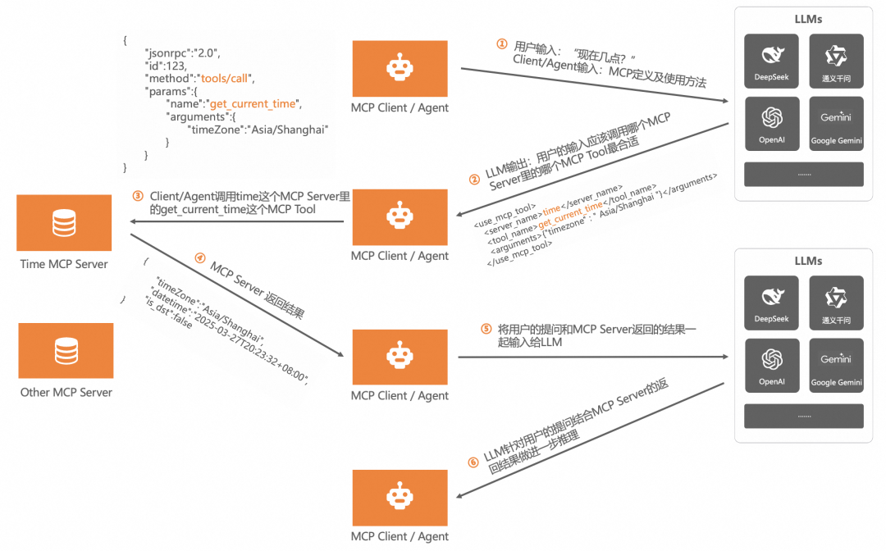

# MCP 协议关于tool 的几个基础问题


在上次写的 `MCP` 生成Git commit的demo里，我当时遗留了好几个问题，正好最近这个 `MCP` 我也用了一周多了，结果实际使用中遇到的问题，再去官网文档仔细翻了翻，算是对 `MCP` 开发中一些基础概念做一个回顾。


因为我开发的是一个 `MCP tool` ，所以这里也只讲讲 `MCP tool` 的一些基本概念，其他的 `Prompts` 、`Resources` 、`Sampling` 、`Roots` 之类的，貌似目前的 `cursor` 还不支持，暂时用不上，就先不管了，感兴趣的同学可以去官方文档看看。


下面主要包含这几部分内容：

* MCP协议中，host是怎么知道tool的信息的（包括描述及各个参数定义）
* host是怎么知道该不该调用MCP，具体调用哪个MCP的
* 基于上面2部分理解，对`cxcy-git-mcp-server` 这个生成格式化Git commit的MCP代码优化升级


## MCP tools 交互基础

在上一个demo里，我有提到当时自己没想清楚的一个点，就是我在 `MCP server`代码里，对工具的3个入参分别定义了 `zod` 校验，但是我在 `cursor` 的 `MCP` 列表里，能清楚看到每个字段的详细说明，当时我说代码里并没有 `export` 这些定义，不知道 `cursor` 是怎么拿到的。 

其实仔细想想也能想清楚，我们开发的是一个server，并且用的是 `MCP` 官方封装好的一个SDK，他内部自然可以提供很多自带的 `API` 来暴露一些信息给 `MCP client` 。`MCP client` 和 `MCP server` 之间并不是类似JavaScript代码里 `import` 来相互通信的，而是通过 `stdio` 或者 `HTTP` 接口，因此只需要server有提供 `API` ，`client` 就能通过 **约定** 的 `API` 来获取到server希望暴露的信息。

[MCP官方文档关于tool部分](https://modelcontextprotocol.io/docs/concepts/tools) 也讲的很清楚，`MCP tool` 包含了如下几个关键的点：

* 工具发现：`MCP client` 可以通过调用 `MCP server` 约定好的 `tools/list` 这个API，来获取到对应 `MCP server` 提供的全部工具，以及每个工具的定义（包含了工具惟一名字、描述信息、参数及描述信息） 
* 工具调用：`MCP client` 通过调用 `MCP server` 的 `tools/call` 这个 API，来调用不同的tool并获取到对应结果。
* 灵活性：tool内部实现是个黑盒，可以简单也可以很复杂，对client是透明的。
* 工具注解：工具可以包含一些注解（元数据），说明自己有哪些副作用、是否幂等、是否会修改环境、是否和外部系统交互。这些注解也是给LLM看到，方便LLM理解和使用工具。
* 工具动态更新：MCP支持动态增加、删除、修改工具，并且 `MCP server` 可以主动通过 `notifications/tools/list_changed` 通知 client对应的变化，client也能随时调用 `tools/list` 来获取最新的工具信息。

通过上面这些不难发现，`cursor` 里能够显示出我的 `cxcy-git-mcp-server` 工具名、描述信息和全部参数信息，就是通过第一个 工具发现`tools/list` 从我的 MCP server获取到的。


## cursor怎么知道什么场景去调哪个MCP

通过上面的铺垫，我们现在知道了，cursor是通过  `mcp.json` 这个配置文件，来引入需要的一系列 MCP server。然后，我们也知道了，每个MCP server都对外提供了 `tools/list` 这个API来暴露自己全部的工具名称、描述以及对应的参数信息。

现在有个问题，当我在cursor聊天界面，输入一句话的时候，cursor是怎么知道要不要去调用MCP呢，如果需要的话，具体是调用哪一个MCP呢？

说起来也简单：这一步（决定要不要调用MCP，以及调用哪个MCP），其实还是背后的LLM来实现的。**当用户在聊天界面输入一句话的时候，cursor会把用户输入的内容，已经当前接入的全部MCP信息（包含每个MCP的工具及相关信息），一起发给LLM，让LLM来判断用户的意图是否需要调用MCP以及调用哪个MCP**。

这里我直接引用阿里这篇 [万字长文告诉你如何基于MCP实现AI应用架构新范式转型](https://mp.weixin.qq.com/s/EISP9z0DWj0bhNzgJogftQ) 里的例子吧，他里面的例子和配图讲的很清楚：

> 下面内容引用自改文章的 【**MCP 的运作机制**】 部分



如上图所示，一次基于MCP的调用，一共有6个核心的步骤。我们先拟定一个前提：

- 我要开发一个获取时间的AI Agent，用户在使用这个AI Agent时，只需要问类似“现在几点了？”这种问题即可。
- 我已经有了一个关于处理时间的MCP Server，这个MCP Server里有2个MCP Tool，一个负责获取当前时区，一个负责获取当前时间。

调用步骤解析：

- 第一步：用户向AI Agent问“现在几点了？”，此时AI Agent就是MCP Client，它会把用户的问题和处理时间的MCP Server以及MCP Tool的信息一起发送给LLM。
- 第二步：LLM拿到信息后开始推理，基于用户的问题和MCP Server的信息，选出解决用户问题最合适的那个MCP Server和MCP Tool，然后返回给AI Agent（MCP Client）。

- 这里LLM返回给AI Agent的信息是：“你用time这个MCP Server里的get_current_time这个MCP Tool吧，它可以解决用户的问题”

- 第三步：AI Agent（MCP Client）现在知道该使用哪个MCP Server里的哪个MCP Tool了，直接调用那个MCP Tool，获取结果。

- 调用time这个MCP Server里的get_current_time这个MCP Tool。

- 第四步：Time MCP Server返回结果（当前的时间）给AI Agent（MCP Client）。
- 第五步：AI Agent（MCP Client）也很懒啊，把用户的问题和从Time MCP Server处拿到的结果再一次给了LLM，目的是让LLM结合问题和答案再规整一下内容。
- 第六步：LLM把规规整整的内容返回给AI Agent（MCP Client），最后AI Agent（MCP Client）再原封不动的返回给了用户。

在MCP的整个调用过程中有一个非常核心的点就是**MCP Server 以及 MCP Tool 的信息。**从第一步，第二步可以看出，这个信息非常关键，是它让LLM知道了该如何解决用户的问题，这个信息就是MCP中最重要的System Prompt，本质上就是PE工程。

推荐大家阅读下原文：https://mp.weixin.qq.com/s/EISP9z0DWj0bhNzgJogftQ


## 实战感受

结合上面对一些MCP基础知识的梳理，以及我之前开发的生成特定Git commit信息的 MCP  （就是这个 `cxcy-git-mcp-server`）实际使用感受，我发现cursor在调用MCP过程中，确实还是 **不稳定** 的，我在聊天界面输入同样的命令，cursor在决定是否调用以及具体生成调用参数的时候，都可能出问题，包括下面这些情况：

* 有时候没有识别到应该调用我的MCP
* 获取当前分支名字错了
* 获取当前仓库的用户名错了

虽然我之前在每个参数里，已经明确备注了cursor应该使用什么命令来获取对应参数的值，但cursor有时候还是没有遵循我的备注，而是自己通过别的shell命令来获取了，导致可能拿到错误的！

因此，参考了一些别人的MCP，我尝试再次更新了我的MCP代码，现在代码里包含了更加详尽的工具描述信息，接下来一周我会继续测试下，在这么详尽的工具描述下，cursor能否提高MCP调用和拼参的准确性。

同时，**这次更新加入了一些使用优化**，之前我在cursor里输入 `commit` 指令之前，需要自己手动先去命令行执行 `git add .` 把文件添加到暂存区，这一次，我也尝试让cursor自己去实现这一步，如果暂存区没有内容，就自己去执行 `git add .` 把当前修改都添加到暂存区，进一步自动化。我也期待cursor能否准确的识别我的工具并执行。

新的 `cxcy-git-mcp-server` MCP 代码如下：

```typescript
#!/usr/bin/env node

import { McpServer } from "@modelcontextprotocol/sdk/server/mcp.js";
import { StdioServerTransport } from "@modelcontextprotocol/sdk/server/stdio.js";
import { z } from "zod";

// 初始化 MCP 服务器
const server = new McpServer({
  name: "cxcy-git-mcp-server",
  version: "0.1.0"
});

// 定义工具的输入参数结构
const commitToolArgs = {
    branchName: z.string().describe("当前 Git 分支名称，格式为 XXXX-YYYYYYYY-ZZZ。LLM必须使用 git branch --show-current | cat 来获取当前分支，不要自己编造分知名！"),
    commitDigest: z.string().max(30).describe("本次修改内容的简要描述，限制在30字以内。LLM优先自动根据当前文件diff来生成，不是每次提示用户输入。LLM可以使用命令git diff --staged来获取当前文件的diff。注意，LLM生成的commitDigest，长度必须限制在30个字以内，如果超出了30个字，LLM必须自己简化下，然后再发给本mcp server。"),
    userName: z.string().describe("当前仓库的用户名，LLM必须从 git config user.name 获取")
};

const generateCommitMessageToolDescription = `
本工具是针对Git仓库的，根据当前分支名称、修改内容和用户名生成 Git 提交信息。

## 使用场景
如果用户在和LLM交互时，表达了希望LLM自动生成commit的意愿，应该调用本工具。包括但不限于以下用户输入指令（只要LLM判断用户有生成commit的意愿，就应该调用本工具）：
- 生成commit
- commit
- 提交
- 提交代码
- 提交修改

## 本工具前置依赖

- LLM在调用本工具前，必须先检查用户当前是否在git仓库中，如果不在git仓库中，应该提示用户先进入git仓库。
- 如果用户在Git仓库中，但是当前暂存区没有内容，LLM应该自动执行 \`git add .\n\` 命令，将所有修改的文件添加到暂存区。如果执行完命令后，暂存区仍然没有内容，LLM必须提示用户当前暂存区没有内容，无法生成commit信息。

## 输入参数
- branchName: 当前 Git 分支名称，格式为 XXXX-YYYYYYYY-ZZZ。LLM必须使用 git branch --show-current | cat 来获取当前分支，不要自己编造分知名！
- commitDigest: 本次修改内容的简要描述，限制在30字以内。LLM优先自动根据当前文件diff来生成，不是每次提示用户输入。LLM可以使用命令git diff --staged来获取当前文件的diff。注意，LLM生成的commitDigest，长度必须限制在30个字以内，如果超出了30个字，LLM必须自己简化下，然后再发给本mcp server。
- userName: 当前仓库的用户名，必须从 git config user.name 获取，严禁LLM从其他地方获取当前仓库的用户名！

## 输出
- 包含git commit命令的bash命令字符串，不要包含任何其他字符。LLM应该尽可能拿到对应的commit文字之后，必须再次校验commit信息是否符合上述要求，如果符合要求，尽量直接自动运行该命令（如果用户默认运行自动运行命令），否则，显示一个命令执行的界面，用户可以直接点击运行按钮来执行该结果命令。

## 示例：

输入：
branchName: BJKF-00000123-devXXFeature
commitDigest: 修改了XXX文件
userName: 张三

输出：
git commit -m "#BJKF-00000123 修改了XXX文件 张三"


`;

// 注册工具
server.tool("generate-commit-message", generateCommitMessageToolDescription, commitToolArgs, async ({ branchName, commitDigest, userName }) => {
  const branchParts = branchName.split("-");
  const secondPart = branchParts[1].padStart(7, '0');
  const branchPrefix = `${branchParts[0]}-${secondPart}`;
  const commitMsg = `#${branchPrefix} ${commitDigest} ${userName}`;
  // Ensure the commit message is properly quoted for the command line
  const quotedCommitMsg = JSON.stringify(commitMsg);
  const command = `git commit -m ${quotedCommitMsg}`;
  return {
    // Use the 'resource' type to suggest the command
    content: [
      {
        type: "text",
        text: `请在终端中运行以下命令：\n\n\`\`\`bash\ngit commit -m "${commitMsg}"\n\`\`\``
      }
    ]
  };
});

// 连接到 stdio 以接收和发送消息
const transport = new StdioServerTransport();
await server.connect(transport);

```


## 相关链接


* [MCP 核心概念，官方文档](https://modelcontextprotocol.io/docs/concepts/architecture)
* [万字长文告诉你如何基于MCP实现AI应用架构新范式转型](https://mp.weixin.qq.com/s/EISP9z0DWj0bhNzgJogftQ)
* [AI Agent破局：MCP与A2A定义安全新边界](https://mp.weixin.qq.com/s/x3N7uPV1sTRyGWPH0jnz7w)
* 