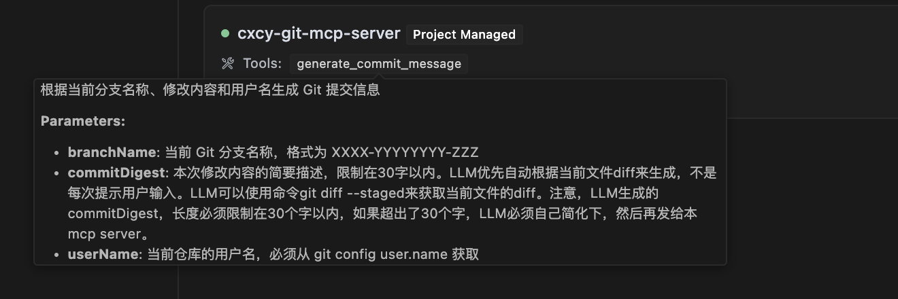

# MCP server 开发半入门——"hello world"


最近 `MCP`  很火，我关注公众号里，好几个大的公众号都在持续输出关于 `MCP` 相关的技术文章，感觉这些文章看来看去都差不多，不管是“入门”还是“深入理解”，看完之后，除了说写的很好，然后我啥也不会，似乎也没留下点什么。

**纸上得来终觉浅**，还是得写写经典的“hello world”才行啊，有条件要上，没有条件创造条件也要上。


**文章大纲** 

* MCP实战：生成特定的Git commit信息
* 什么是MCP（Model Context Protocol）
* MCP整体架构


本来应该是先介绍什么是MCP以及MCP整体架构，最后再上实战demo。但是感觉后面2部分都是ChatGPT帮忙整理的，没啥意思，还不如先看看我们要做一个事情，以及最终的效果，最后感兴趣再看看MCP的一些基础信息。


## MCP实战：生成特定的Git commit信息

从一个故事开始。

一个朋友最近跟我吐槽，说他们公司关于 `git` 代码提交，最近统一制定了一些很好很强大的强制规范，让他每次提代码的时候都很头疼。公司关于 `git` 的强制要求是：

* Git分知名必须是，BJXX-0000123-自定义名 这3部分组成，其中 BJXX 是所在部门缩写，中间是对应需求编码，不足7位的要补0，最后可以自己加一个后缀，方便开发者识别
* Git commit 格式规范：`#0000123 变更描述文字 开发者名字` 

看到这样的规范，我默默的发送了这个表情。

规范虽好，但开发者痛苦了，朋友每次都得找个地方临时记录模板来修改，遇到多个需求并行，还得保留多个模板。正如你知道的，码农是世界上最懒的一群人，这么痛苦的事情，肯定想能不能交给谁来自动实现呢？

正好最近技术圈被 `MCP` 刷屏了，要不强制整个 `MCP server`，咱也向时代的前列腺靠近一点点？

### MCP server开发

这个不知道算不算`MCP`的 `MCP`，其实功能很简单，就是提供一个 `tool` 给 `MCP client` （在朋友的这个场景下，对应的是 `cursor`这款AI代码编辑器）调用，这个工具的入参包含下面3个：

* 当前仓库的分支名字
* 当前仓库的作者名字
* 本次变更的描述摘要文字

当前分知名和作者名这2个参数，通过传统方式很容易拿到，执行下相关的 `git` 命令即可。但是本次变更的描述摘要，就需要LLM自动根据当前的 `changes` 来生成的。

最麻烦的工作其实LLM已经自己做了，剩下的 `MCP` 内的逻辑，很简单（简单到我都不知道这算不算一个 **正经的** `MCP`），完整代码如下：

```typescript
#!/usr/bin/env node

import { McpServer } from "@modelcontextprotocol/sdk/server/mcp.js";
import { StdioServerTransport } from "@modelcontextprotocol/sdk/server/stdio.js";
import { z } from "zod";

// 初始化 MCP 服务器
const server = new McpServer({
  name: "cxcy-git-mcp-server",
  version: "0.1.0"
});

// 定义工具的输入参数结构
const commitToolArgs = {
    branchName: z.string().describe("当前 Git 分支名称，格式为 XXXX-YYYYYYYY-ZZZ"),
    commitDigest: z.string().max(30).describe("本次修改内容的简要描述，限制在30字以内。LLM优先自动根据当前文件diff来生成，不是每次提示用户输入。LLM可以使用命令git diff --staged来获取当前文件的diff。注意，LLM生成的commitDigest，长度必须限制在30个字以内，如果超出了30个字，LLM必须自己简化下，然后再发给本mcp server。"),
    userName: z.string().describe("当前仓库的用户名，必须从 git config user.name 获取")
};

// 注册工具
server.tool("generate-commit-message", '根据当前分支名称、修改内容和用户名生成 Git 提交信息', commitToolArgs, async ({ branchName, commitDigest, userName }) => {
  const branchParts = branchName.split("-");
  const secondPart = branchParts[1].padStart(7, '0');
  const branchPrefix = `${branchParts[0]}-${secondPart}`;
  const commitMsg = `#${branchPrefix} ${commitDigest} ${userName}`;
  return {
    content: [
      {
        type: "text",
        text: `请在终端中运行以下命令：\n\n\`\`\`bash\ngit commit -m "${commitMsg}"\n\`\`\``
      }
    ]
  };
});

// 连接到 stdio 以接收和发送消息
const transport = new StdioServerTransport();
await server.connect(transport);

```

代码开发完成（并调试通过）后，我们可以发布到 `npm ` 上，这样就可以在 `cursor` 里通过 `npm` 包的名字来接入这个 `MCP` 了，假设我们发布到 `npm ` 上的包名是：`cxcy-git-mcp-server`。

### cursor接入MCP server

在上面，我们已经完成了 `MCP server` 的开发工作（嗯，虽然没几行代码），现在是时候去 `cursor` 里接入该 `MCP` 了。

`cursor` 支持在全局添加 `MCP` 或者在单个项目下添加，我这里是在单个Git仓库下添加的。在项目根目录下，新建 `.cursor/mcp.json` 文件，内容如下：

```json
{
  "mcpServers": {
      "cxcy-git-mcp-server": {
          "command": "npx",
          "args": [
            "-y",
            "cxcy-git-mcp-server"
          ]
      }
  }
}
```

熟悉前端开发的同学应该能看懂上面的意思，就是去执行 `cxcy-git-mcp-server` 这个 `npm` 包。添加之后，我们可以在 `cursor` 的设置页面-MCP 下面，看到我们添加的全部 `MCP`列表以及对应是否添加成功的状态：


注意每个 MCP 左侧有个绿色的点，代表是否接入成功了，可以看到，我们的MCP已经成功接入，并且识别出来了我们添加的工具：`generate-commit-message` （对应上面代码里的）。

**这里有一个很霸道的地方，当我把鼠标hover到工具名的时候，完整的显示了这个工具的描述以及各个参数字段的校验规则** ，但是我们的MCP代码里，并没有把参数描述给 `export` 出来，这真的是超出我的认知了，等后面再去了解下为什么。



**可能你会觉得奇怪，为什么我在MCP代码里，要把每个参数的描述写的这么详细，包括应该从哪儿获取**。

嗯，good question。刚开始我并没有描述到这么详细，并没有写通过什么方式获取文件diff和当前仓库的用户名，然后我在cursor里运行这个MCP的时候，他获取这些信息的方式是不稳定的，有时候会正确的方式获取，有时候拿到的是错误的，比如仓库的用户名，有时候他会拿当前系统的用户名字……

然后我发现了cursor在运行MCP的时候，拿到了我对每个字段的描述，所以我就尝试了，在每个字段里直接说清楚，cursor应该怎么获取对应的字段数据。他真的就按照我在描述里给的方式去获取了！！

**可能，这就是LLM吧，不懂他是怎么运作的、不懂他是怎么看到我代码里描述的，但他就是能work……** 


### 运行效果

最后来看看实际运行效果吧，我朋友（注意是我朋友，不是我）在一顿代码输出之后，做如下步骤：

* 自己去shell里添加本次修改的文件，执行 `git add .`
* 打开 `cursor` 的 `composer` 面板，输入指令 `git commit ` 或者 `生成commit`。cursor自动收集上面的3个参数并且自动调用 MCP，拿到MCP输出后，提示一个 `shelll` 运行框，内容就是 `git commit -m "#XXXX-0000123 commit摘要 作者"` （这里也是不稳定的，有时候cursor会直接自动运行，有时候只会显示出来，让朋友手动点击运行）

效果截图如下：


## 什么是MCP（Model Context Protocol）


先贴一个`MCP` 官方文档链接：https://modelcontextprotocol.io/introduction


>下面是一段来自ChatGPT对“什么是MCP”的介绍，比我总结的好，就直接引用了。


在现代软件开发中，各种工具和系统之间需要进行信息交流、参数传递和状态共享。而 MCP，即 Model Context Protocol（模型上下文协议），正是为此目的而设计的一套标准化通信协议。下面，我们将从多个角度介绍 MCP，让初学者也能够轻松理解它的意义与作用。

## 1. 协议的诞生背景

在软件工程中，不同工具和服务（如代码编辑器、命令行工具、AI 助手等）常常各自为政，信息传递存在格式不统一、接口不标准的问题。MCP 便是在这种需求的背景下诞生的，它提供了一种标准化的方式，让各种应用程序能够用一致的方法交换信息。

## 2. MCP 的核心思想

**标准化通信**
 MCP 规定了传输数据的格式、数据类型以及交互规则，使得开发者在设计工具或服务时可以依照同一套标准，从而实现无缝连接。这意味着，无论你是在构建一个用于生成 Git 提交信息的服务，还是开发一个用于代码提示的 AI 助手，只要遵循 MCP 协议，就可以确保各个组件之间的信息传递不会出错。

**上下文传递**
 正如它的名称所示，MCP 强调“上下文”这一概念。上下文可以理解为当前操作的环境信息，比如当前 Git 仓库的分支名称、代码修改内容摘要、用户信息等。通过上下文的传递，服务端与客户端之间能够基于当前工作状态做出智能响应。例如，在一个代码编辑器中，当用户修改了一段代码，编辑器可以自动生成一条提交命令；而这条命令的生成过程就可以由遵循 MCP 协议的服务端完成，然后返回给客户端执行。

## 3. MCP 如何帮助开发者

对于初学者来说，采用 MCP 有以下几点好处：

- **简化集成过程**
   MCP 定义了一套公共的接口和数据格式，让不同工具之间的整合变得更加简单。开发者无需为每个工具编写专门的适配代码，只需要遵循 MCP 标准即可。
- **提高扩展性和互操作性**
   当多个工具（例如代码编辑器和版本控制系统）都遵循 MCP 标准时，它们之间的信息交换可以更顺畅。如果未来需要增加新的功能或工具，只要它们遵循 MCP，就能很容易地接入整个生态系统。
- **避免重复造轮子**
   MCP 提供了标准化的协议定义，帮助开发者在各自的应用中快速构建与其他服务对接的模块，节省了大量自定义接口设计和调试的工作量。

## 4. MCP 在实际场景中的应用

假设你使用一个智能代码编辑器（例如 Cursor），它可以根据你在 Git 仓库中的修改自动生成提交信息。MCP 就在这个过程中发挥了关键作用：

- **自动生成提交信息**
   编辑器可以通过 MCP 与服务端通信，将当前分支名称、代码改动摘要、用户信息等上下文数据发送给服务端。
- **返回标准化响应**
   服务端按照 MCP 协议的规定构造响应，例如返回一个格式化的提交命令。这种响应格式既明确又标准，编辑器收到后可以直接显示一个命令运行框或者自动执行该命令，无需额外提示用户手动输入。
- **提高用户体验**
   通过自动化上下文传递和标准化消息格式，MCP 大幅简化了用户操作流程，让开发者能将更多精力放在核心业务上，而非在各种格式转换与适配上耗时耗力。

## 5. 尊重和遵循官方协议标准

根据 MCP 官方文档[（点击了解更多）](https://modelcontextprotocol.io/introduction)的介绍，MCP 设计旨在为开发者提供一种清晰、简洁且功能强大的工具交互规范。使用 MCP 时，开发者应该注意以下几点：

- **严格遵守数据格式和类型定义**
   MCP 协议中的每个字段和数据类型都有明确的定义，确保不同组件之间能够无误地解析和处理传递的数据。
- **关注上下文信息完整性**
   在构造请求和响应时，必须完整传递必要的上下文信息。只有这样，才能确保服务端能够根据当前状态做出正确的响应。
- **保持协议扩展的开放性**
   MCP 为未来的新特性和扩展提供了预留空间，开发者可以在不破坏现有协议规则的前提下，逐步增加新的功能模块。


## MCP整体架构


在 MCP 的核心设计中，它采用了 **客户端-服务器** 的架构，一个主机（Host）可以同时连接多个服务器：


### 各角色说明：

- **MCP 主机（MCP Hosts）**
   这是那些希望通过 MCP 访问数据的应用程序，比如 Claude Desktop、各种 IDE 或其他 AI 工具。
- **MCP 客户端（MCP Clients）**
   指的是与服务器建立一对一连接的协议客户端，负责发送请求并接收服务器的响应。
- **MCP 服务器（MCP Servers）**
   是一些轻量化的程序，它们通过标准化的 Model Context Protocol 暴露出特定的功能接口。
- **本地数据源（Local Data Sources）**
   就是指你电脑上的文件、数据库以及其他可以被 MCP 服务器安全访问的本地服务。
- **远程服务（Remote Services）**
   指的是互联网上的外部系统（例如通过 API 提供服务的系统），MCP 服务器可以连接这些服务获取数据或执行操作。

总的来说，这个架构让不同的程序（比如 IDE 或 AI 工具）通过 MCP 协议轻松访问自己电脑或互联网上的各种数据和服务，每个 MCP 服务器专注于一项特定的功能，而 MCP 客户端则负责与这些服务器保持稳定的连接，从而实现高效的信息交换和协同工作。